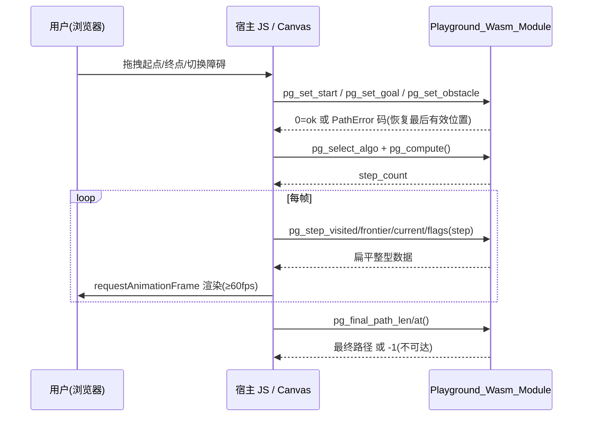

# Design Document · 技术设计文档

> Championship_V1_Upgrade（冠军级 v1.0.0 升级）· 全程中文撰写 · 默认 🟣 档位3「业界顶尖（旗舰）」标准
>
> 本设计基于 `.kiro/specs/championship-v1-upgrade/requirements.md`（22 条需求 / 6 大方向 + 横切质量约束）。
> 设计的最高纲领是 **「冻结既有公开 API + bypass 新增」**：本升级不修改、不删除任何既有公开签名，
> 全部能力以新增包、新增类型、新增函数的方式落地，`.mbti` 接口文件只增不减（Requirement 22.3 / 22.8）。

---

## Overview

> 概览

### 设计目标

将 `moonbit-pathfinding`（当前 v0.0.3）从「功能完备的算法库」拔高为「面向 OSC 2026 的冠军级 v1.0.0」。
本设计在既有 30 种经典算法 + 3 种实验级算法（CH/JPS/ALT）、`@infra_pbt`、`@infra_text`、运行时证明谓词框架
（当前仅 BFS/Dijkstra）、三后端一致性 CI 之上做 **增量升级**，补齐六大维度：

| 方向 | 核心交付物 | 关键需求 |
|---|---|---|
| 1 · WASM Playground | `src/playground` 包 + wasm-gc 导出层 + 宿主页面 + GitHub Pages 流水线 + 体积门禁 | R1–R4 |
| 2 · 性能冠军 | `src/infra_bench` 包 + Benchmark/Regression 框架 + Rust 对比方法学 + 10k 压测 + CH/JPS/ALT 生产级 | R5–R8 |
| 3 · 形式验证升级 | `src/proofs` 泛化谓词组合子 + 30 算法证明文件 + 循环不变式注解 + Proof_Pipeline | R9–R11 |
| 4 · API 人机工程学 | `src/graph` 包：GraphBuilder + PathError + Lazy_Path_Iterator + Graph_Adapter | R12–R15 |
| 5 · 差分/模糊测试 | `src/infra_fuzz` 包 + Differential_Tester + 覆盖率门禁 | R16–R18 |
| 6 · 文档卓越 | `src/docgen` 包：Doc_Generator + ASCII 可视化 + Cookbook + 文档行数门禁 | R19–R21 |
| 横切 | 全方向统一质量基线（PBT≥100、三后端一致、API 冻结、无 O(n²) 拼接、无占位） | R22 |

### 设计哲学（承袭既有 API 风格）

- **successor function 范式**：算法以 `fn(N) -> Array[N]`（无权）或 `fn(N) -> Array[(N, W)]`（带权）暴露邻居，
  泛型节点 `N : Eq + Hash`，权重 `W : @core.Weight`。所有新增能力围绕该范式构建，不引入新的图核心抽象去与既有算法竞争。
- **Result vs Option 并存**：既有「不可达即 `None`」的 `Option` 签名保持冻结；新增「结构化失败」入口返回
  `Result[_, @graph.PathError]`（Requirement 13.8）。
- **基础设施下沉**：跨方向复用的代码只放基础设施包（`@core`/`@infra_text`/`@infra_pbt`/新增 `@infra_bench`/`@infra_fuzz`），
  严禁跨方向包（`unweighted`/`directed`/`undirected`/`advanced`）互相直接依赖（Requirement 22 包依赖控制）。
- **文本构建统一走 `@infra_text.TextBuilder`**：所有报告、诊断消息、复杂度表、ASCII 图的构建禁止循环内 `+` 拼接
  （Requirement 19.4 / 13.7 / 22.4）。

### 新增 / 修改边界声明

- **只新增不修改**：`@core.PathError`（既有 4 变体：`NegativeCycle`/`CycleDetected`/`InvalidInput`/`InvalidK`）保持冻结。
  Requirement 13 要求的「5 互斥变体错误类型」以 **新包 `@graph.PathError`** 提供，与 `@core.PathError` 命名空间隔离，互不影响。
- **既有算法签名零改动**：CH/JPS/ALT 升级为生产级时只新增能力（如预处理质量改进、新增查询入口），既有
  `ch_preprocess`/`ch_query`/`jps`/`alt_preprocess`/`alt_query` 签名逐项保持不变（Requirement 8.6）。

---

## Architecture

> 架构

### 包依赖拓扑（新增包以 ★ 标注）

```mermaid
graph TD
  core["@core (Weight / PathError / PQueue / DSU)"]
  text["@infra_text (TextBuilder)"]
  pbt["@infra_pbt (Gen/Rng/holds_for_all/shrink/Stats)"]

  uw["@unweighted (bfs, bfs_all)"]
  dir["@directed (dijkstra, astar, ...)"]
  und["@undirected (kruskal, prim, ...)"]
  adv["@advanced (ch, jps, alt)"]

  graph["★ @graph (GraphBuilder / PathError / LazyPath / GraphAdapter)"]
  bench["★ @infra_bench (BenchStats / BenchReport / RegressionGuard)"]
  fuzz["★ @infra_fuzz (FuzzGraph 生成器 + shrink + 差分比较器)"]
  docgen["★ @docgen (AlgoMeta / Complexity_Table / Ascii_Visualization)"]
  play["★ @playground (Grid / Step_Trace / Stepper / wasm 导出)"]
  proofs["@proofs (谓词组合子 + 30 算法证明 + 不变式断言)"]

  core --> uw
  core --> dir
  core --> und
  core --> adv
  core --> graph
  text --> graph
  core --> bench
  text --> bench
  pbt --> fuzz
  core --> fuzz
  text --> docgen
  core --> play
  text --> play
  core --> proofs

  %% 测试期（仅 *_test.mbt）才允许的依赖，用虚线
  graph -.parity test.-> dir
  play  -.parity test.-> uw
  play  -.parity test.-> dir
  play  -.parity test.-> adv
  fuzz  -.diff test.->  dir
  proofs -.predicate test.-> uw
```

**依赖规则（Requirement 22 包依赖控制）**：
- 生产代码（非 `_test.mbt`/`_wbtest.mbt`）中，新增包只依赖基础设施包（`@core`/`@infra_text`/`@infra_pbt`）。
- 对具体算法包（`@unweighted`/`@directed`/`@advanced` 等）的依赖 **只允许出现在测试文件**（差分/一致性校验），
  以图中虚线表示；这样既能做交叉验证，又不在生产依赖图中制造跨方向耦合。
- `@playground` 的逐步执行引擎以 successor function 为唯一输入，不在生产代码里依赖任何算法包；与既有算法的「结果一致性」
  仅在 `*_test.mbt` 中验证（Requirement 3.3 路径口径对齐 BFS/Dijkstra/A\*）。

### 跨方向门禁与流水线总览


所有门禁均为 **非零退出即失败**，并产出可审计的 MD+JSON 双格式工件（与既有 `scripts/*.ps1` 风格一致）。

---

## Components and Interfaces

> 各方向组件设计

> 以下接口签名为 MoonBit「设计草图」，最终以 `moon info` 生成的 `.mbti` 为准。
> 所有结构化数据一律使用枚举/结构体，禁止字符串模拟（Requirement 22.6）。

### 方向 1 · WASM Playground（`src/playground`）

#### 1.1 逐步执行引擎（Stepper）

逐步执行引擎是 Playground 的核心：它在 successor function 之上运行 BFS/DFS/Dijkstra/A\*/JPS，并在每一步产出
**结构化单步状态**（已访问集合 / 待扩展边界 / 当前节点 / 终止标志），供宿主逐帧回放（Requirement 1.2、3.1）。

```moonbit skip
/// 可视化支持的算法档（精确枚举，禁止字符串模拟 · R22.6）
pub enum PlaygroundAlgo {
  BFS
  DFS
  Dijkstra
  AStar
  JPS
} derive(Eq, Show)

/// 单步可观察状态（Requirement 1.2）。N 在网格场景下实例化为格子线性下标 Int。
pub struct StepState[N] {
  visited : Array[N]    // 截至当前步、已永久访问（closed）的节点，按访问顺序
  frontier : Array[N]   // 当前待扩展边界（open set）
  current : N?          // 本步正在扩展的节点；None 表示尚未开始或已终止
  done : Bool           // 终止标志：搜索是否结束
  found : Bool          // 是否已找到目标
}

/// 完整逐步轨迹（Step_Trace · 术语表）。供动画逐帧消费。
pub struct StepTrace[N] {
  algo : PlaygroundAlgo
  steps : Array[StepState[N]]   // 每帧一个 StepState
  final_path : Array[N]?        // 目标可达时的回溯路径，否则 None（R3.3/3.4）
  reachable : Bool
}

/// 在 successor 之上生成一条 Step_Trace。纯函数、可复现。
/// `heuristic` 仅 AStar/JPS 使用；BFS/DFS/Dijkstra 传入恒零启发即可。
pub fn[N : Eq + Hash, W : @core.Weight + Compare] trace_search(
  algo : PlaygroundAlgo,
  start : N,
  goal : N,
  successors : (N) -> Array[(N, W)],
  heuristic : (N) -> W,
) -> StepTrace[N]
```

**设计决策（路径口径，R3.3）**：BFS/Dijkstra/A\* 的 `final_path` 为最短路径；DFS/JPS 的 `final_path` 为算法回溯
得到的最终路径。`trace_search` 内部对每种算法独立维护 open/closed 结构，每次主循环弹出节点即追加一帧 `StepState`，
保证动画帧序与算法真实扩展序严格一致。

#### 1.2 网格模型与端点编辑

```moonbit skip
/// 网格模型：行优先线性存储，格子下标 = row * cols + col。
pub struct Grid {
  rows : Int
  cols : Int
  blocked : Array[Bool]   // 长度 rows*cols；true 表示障碍
  start : Int             // 起点线性下标
  goal : Int              // 终点线性下标
}

pub fn Grid::new(rows : Int, cols : Int) -> Result[Grid, @graph.PathError]

/// 拖拽/编辑操作返回 Result：非法放置（越界/障碍/与另一端点重叠）返回 Err，
/// 调用方据此恢复到拖拽前的最后有效位置（Requirement 2.3/2.5）。
pub fn Grid::set_start(self : Grid, cell : Int) -> Result[Grid, @graph.PathError]
pub fn Grid::set_goal(self : Grid, cell : Int) -> Result[Grid, @graph.PathError]
pub fn Grid::toggle_obstacle(self : Grid, cell : Int) -> Result[Grid, @graph.PathError]

/// 把网格转换为 4-邻接 successor（均匀单位权），供 trace_search 使用。
pub fn Grid::to_successors(self : Grid) -> (Int) -> Array[(Int, Int)]

/// 网格曼哈顿启发（A\*/JPS 用）。
pub fn Grid::manhattan(self : Grid, goal : Int) -> (Int) -> Int
```

**设计决策（编辑即纯变换）**：所有编辑操作返回新的 `Grid`（值语义），非法操作返回 `Err` 且 **不改动入参**，
这使「拒绝放置并恢复最后有效位置」成为调用方的纯逻辑，便于 PBT 验证（R2.3/2.5）。200ms / 60fps 等时延指标
属宿主渲染层 SLA，由宿主 JS 的 `requestAnimationFrame` 调度保证，本库只保证 `trace_search` 的算法复杂度为 O(V+E)。

#### 1.3 wasm-gc 导出层与体积优化

wasm-gc 导出层是宿主 JS 与 MoonBit 之间的边界。受 wasm-gc 跨语言传值限制，采用 **「句柄 + 扁平整型读取」** 协议：
一次 `pg_compute` 在 MoonBit 侧物化 `StepTrace[Int]`，宿主再按帧、按数组下标拉取整型数据，避免复杂结构跨边界拷贝。

```moonbit skip
// playground/exports.mbt —— 仅这些函数标注 wasm export。
// 维持单一全局会话句柄，避免导出泛型/结构体。

pub fn pg_reset(rows : Int, cols : Int) -> Int           // 0=ok, 非0=PathError 码
pub fn pg_set_obstacle(cell : Int, on : Int) -> Int
pub fn pg_set_start(cell : Int) -> Int
pub fn pg_set_goal(cell : Int) -> Int
pub fn pg_select_algo(algo_code : Int) -> Int            // 0=BFS..4=JPS
pub fn pg_compute() -> Int                               // 返回步数 step_count，<0 表示错误码
pub fn pg_step_visited_len(step : Int) -> Int
pub fn pg_step_visited_at(step : Int, i : Int) -> Int
pub fn pg_step_frontier_len(step : Int) -> Int
pub fn pg_step_frontier_at(step : Int, i : Int) -> Int
pub fn pg_step_current(step : Int) -> Int                // -1 表示 None
pub fn pg_step_flags(step : Int) -> Int                  // bit0=done, bit1=found
pub fn pg_final_path_len() -> Int                        // -1 表示不可达（R3.4）
pub fn pg_final_path_at(i : Int) -> Int
pub fn pg_last_error() -> Int                            // 错误码 → PathError 变体（R1.3）
```

**体积优化策略（目标 ≤102400 字节 · R1.1/1.4/1.5）**：

1. **依赖最小化**：`@playground` 生产代码仅依赖 `@core`，**不**链接 `@infra_text`/`@infra_pbt`/`@directed`/`@advanced`，
   把这些重型包挡在 tree-shaking 之外。逐步执行引擎在包内自洽实现，不复用算法包（差分一致性仅在测试期校验）。
2. **整型专用化**：导出层固定 `N = Int`、`W = Int`，避免泛型单态化膨胀与字典传递开销。
3. **零异常路径**：导出层用整型错误码取代结构化抛错，删去格式化/字符串依赖。
4. **release 构建**：`moon build --target wasm-gc --release`，关闭调试信息。
5. **体积门禁脚本** `scripts/wasm_size_guard.ps1`：构建后读取 `.wasm` 文件磁盘字节数，与常量
   `WASM_SIZE_LIMIT = 102400` 比较；超限则记录「实测字节数 vs 上限」并以非零退出阻断发布（R1.4/R4.5）。
   同一脚本重复运行对同一提交产出字节数完全一致（R1.5，依赖确定性构建）。



#### 1.4 宿主页面与 GitHub Pages 部署

- **静态资源**：`playground/web/index.html`、`playground/web/app.js`（Canvas 渲染 + 拖拽 + 帧率计数）、
  `playground/web/style.css`，以及构建产物 `playground.wasm` 与 MoonBit 生成的 JS glue。全部同源，不请求任何外部网络服务（R4.3）。
- **帧率显示**：`app.js` 维护滚动 1 秒窗口的 `requestAnimationFrame` 时间戳队列，每 500ms 刷新实测 fps、网格规模
  （行×列）与算法名（R3.5）；低于 60fps 显示警告但不中断动画（R3.6）。
- **部署流水线** `.github/workflows/pages.yml`：推送主干 → 安装 MoonBit → `moon build --target wasm-gc --release` →
  `wasm_size_guard.ps1`（超限即中止，保留上一成功版本 · R4.5）→ 组装 `playground/web` → 发布到 GitHub Pages，
  全流程 600s 预算内完成（R4.2）；任一步非零退出即中止发布并保留上一版本 + 输出诊断（R4.4）。

### 方向 2 · 性能冠军（`src/infra_bench`）

#### 2.1 Benchmark_Framework 架构

统计量计算是纯函数，作为本库内 MoonBit 代码实现（强 PBT 目标）；计时采集与机器信息收集由 PowerShell 脚本
（承袭 `scripts/benchmark_native.ps1`）完成，二者通过 JSON 工件衔接。

```moonbit skip
/// 汇总统计量（Requirement 5.2）。全部由原始计时样本纯计算得出。
pub struct BenchStats {
  min : Double
  max : Double
  median : Double
  mean : Double
  p95 : Double
  stddev : Double
  sample_count : Int
}

/// 由原始样本计算统计量。要求 samples 非空，否则返回 InvalidArgument。
/// p95 采用「最近秩」(nearest-rank) 定义，stddev 为总体标准差。
pub fn compute_stats(samples : Array[Double]) -> Result[BenchStats, @graph.PathError]

/// 单个基准用例的完整记录（Requirement 5.2）。
pub struct BenchCase {
  algorithm : String
  graph_size : Int       // 节点数
  edge_count : Int
  query_count : Int
  seed : UInt64          // 随机种子，可复现（R5.4）
  raw_ns : Array[Double] // 原始计时样本（≥10 · R5.3）
  stats : BenchStats
}

/// 完整基准报告（Requirement 5.1/5.2）。
pub struct BenchReport {
  moon_version : String
  backend : String           // wasm-gc / js / native
  os : String
  cpu : String
  generator : String         // 输入生成器标识
  warmup_count : Int         // ≥3 (R5.3)
  cases : Array[BenchCase]
}

pub fn BenchReport::to_markdown(self : BenchReport) -> String  // TextBuilder, 无循环内 +
pub fn BenchReport::to_json(self : BenchReport) -> String      // 结构化 JSON 文本
```

**预热与采样（R5.3）**：脚本层对每个用例先丢弃 ≥3 次预热结果，再采集 ≥10 次计时样本喂给 `compute_stats`。
**可复现性（R5.4）**：输入图由 `@infra_fuzz` 的确定性生成器按 `seed` 生成，相同种子逐元素相同；中位计时相对差异
≤5% 视为可比。**环境降级（R5.6）**：缺外部凭据/数据集时记录告警并跳过该用例，继续其余基准而非中止整套。

#### 2.2 Benchmark_Report Schema（MD + JSON）

JSON schema（`schema = "moonbit-pathfinding.benchmark.v1"`，与既有 `latest-native.json` 形态一致并扩展统计字段）：

```json
{
  "schema": "moonbit-pathfinding.benchmark.v1",
  "generated_at": "<ISO8601 UTC>",
  "moon_version": "...", "backend": "native",
  "machine": { "os": "...", "cpu": "...", "processor_count": 0 },
  "generator": "fuzz_graph(seed,n,density)", "warmup_count": 3,
  "cases": [{
    "algorithm": "Dijkstra", "graph_size": 10000, "edge_count": 40000,
    "query_count": 100, "seed": 42, "raw_ns": [/* ≥10 */],
    "stats": { "min": 0, "max": 0, "median": 0, "mean": 0, "p95": 0, "stddev": 0, "sample_count": 10 }
  }]
}
```

MD 报告由 `to_markdown` 用 `TextBuilder` 生成统计表（算法 / 规模 / 边数 / 查询数 / min / median / mean / p95 / stddev）。

#### 2.3 Regression_Guard 设计

```moonbit skip
pub struct RegressionVerdict {
  algorithm : String
  baseline_median : Double
  current_median : Double
  regression_pct : Double   // (current-baseline)/baseline*100
  failed : Bool
}

/// 比较当前报告与基线报告，按算法名配对，中位计时回归超过 tol_pct（默认 10.0）则标记失败。
pub fn regression_check(
  baseline : BenchReport,
  current : BenchReport,
  tol_pct : Double,
) -> Array[RegressionVerdict]
```

脚本 `scripts/regression_guard.ps1` 读签入基线 JSON 与当前 JSON，调用 `regression_check`，任一 `failed=true` 即非零退出，
并在报告中记录算法名、基线中位、当前中位与回归百分比（R5.5）。

#### 2.4 Rust 对比报告方法学

- **等价输入**：本库侧与 Rust 侧用 **相同 64 位种子 + 相同生成算法** 产出逐元素相同的图与查询集（R6.2）。
  生成算法在两侧各实现一份并以「黄金 JSON 图样本」交叉校验逐元素一致。
- **工作负载矩阵**：BFS/Dijkstra/A\* × 规模 {1000, 10000, 100000} × 平均出度 {4, 16} × 每组 ≥100 查询（R6.1）。
- **采样**：≥5 预热 + ≥30 计时样本；记录 CPU/OS/两套工具链版本（R6.3/6.4）。
- **加速比口径**：统一以中位计时计算并呈现（R6.6）。失败/超时（>60s）/两库结果不一致的用例标注并排除出加速比（R6.7）。
- **脚本** `scripts/rust_comparison.ps1` + `bench_rust/`（Cargo 工程，依赖 `pathfinding` crate）：可复现，重跑本库侧中位
  与报告值相对差异 ≤15%（R6.5）。跨机器/跨工具链差异显式标注且不据此声明加速比（R6.8）。

#### 2.5 10k 压力测试设计（R7）

`benches/stress_bench`（或 `*_test.mbt` 形态）在 10000 节点图上跑 BFS/Dijkstra/A\*：每算法 60s 超时上界内终止、
返回有效结果、不改输入图、不 panic（R7.1）。校验：非空路径每条相邻对在图中有边（R7.2）；可达时首=源、末=目标、
返回代价与沿路径权重和偏差 ≤1e-9（R7.3）；不可达返回空/None（R7.4）；超时标记失败并记录诊断（R7.5）。

#### 2.6 CH/JPS/ALT 生产级升级（R8）

- **能力补全（不改签名 · R8.6）**：审查 `@advanced` 三算法消除任何 `abort`/`todo!`/占位（R8.1）；以 **新增** 入口补强
  （如 `ch_preprocess_with_order`、`alt_preprocess_with_landmarks`、批量查询入口），既有 `ch_query`/`jps`/`alt_query` 冻结。
- **OSM 子集接入**：`benches/osm/download.sh` 拉取真实路网子集，解析为 `CsrGraph`（见方向 4）。
  数据缺失时跳过真实路网基准、记录缺失诊断、改用合成数据完成正确性验证而不让套件失败（R8.7）。
- **正确性对拍**：OSM/合成图上 CH、ALT、Dijkstra 对 ≥100 组随机查询返回最短路代价相等（整数精确，浮点 ≤1e-9 · R8.2）；
  均匀代价网格上 JPS 与 A\* 对 ≥100 组查询代价相等（R8.3）。
- **性能证据**：`Benchmark_Report` 记录 CH/JPS/ALT 的预处理耗时、≥10 次重复的平均/中位查询耗时、查询样本量、
  数据集标识与图规模（R8.4）；CH/ALT 记录相对 Dijkstra 的中位加速比并断言平均查询耗时不高于 Dijkstra（R8.5）。

### 方向 3 · 形式验证升级（`src/proofs` 扩展）

#### 3.1 谓词组合子框架（从 BFS/Dijkstra 泛化到 30 算法）

既有 `predicates.mbt` 已提供 `is_valid_path`/`is_reachable`/`path_cost`/`check_*`/`*_post` 等。本设计将其归纳为
**四类可组合谓词**，作为 30 算法证明的统一基座（Requirement 9.1–9.6）：

```moonbit skip
// 四类核心谓词（多数已存在，按需补充泛型重载）：

// (A) path-validity —— 路径结构合法：非空、首=源、相邻对为边
//     既有：is_valid_path / check_edges_valid / check_edges_valid_weighted

// (B) cost-consistency —— 返回代价 == 沿路径边权之和（≤1e-9）
//     既有：path_cost / check_cost_matches_path / check_non_negativity

// (C) none-witness —— 返回 None/空 ⟺ 目标确不可达（用有界 BFS 预言机交叉验证）
//     既有：is_reachable / check_none_witness

// (D) bad-witness rejection —— 对故意构造的违例输入，谓词必判 false 且不改输入
//     以测试驱动（每谓词配 bad-witness 用例）

/// 统一聚合组合子：把上述谓词按算法语义拼装为单一后置条件。
/// 已有 bfs_post / dijkstra_post 即此模式的实例；新增 30 个算法各自的 *_post。
pub fn[N : Eq + Hash, W : @core.Weight] shortest_path_post(
  result : (Array[N], W)?,
  start : N, goal : (N) -> Bool,
  successors : (N) -> Array[(N, W)],
  edge_weight : (N, N) -> W?,
  nodes : Array[N],
) -> Bool
```

**泛化映射（30 算法 → 谓词组合）**：

| 算法族 | 适用谓词组合 |
|---|---|
| 最短路（dijkstra/astar/bellman_ford/dag_sp/bidirectional_*/ida_star/yen/johnson/floyd_warshall） | A + B + C |
| 无权可达（bfs/bfs_all/dfs/bidirectional_bfs） | A + C |
| 生成树（kruskal/prim） | 不变量：结果为生成树（无环、连通、边权和最小，对比 Model） |
| 连通性（connected_components/tarjan_scc/bridges/condensation） | 不变量：分量划分是等价类 / 桥定义 |
| 流与匹配（edmonds_karp/dinic/min_cut/min_cost_flow/hopcroft_karp/kuhn_munkres/eulerian/topo_sort） | 不变量：最大流=最小割、匹配合法性、欧拉/拓扑序合法性 |

每个算法在 `src/proofs/{算法}_proof.mbt` 提供 ≥1 个 `Bool` 返回的后置条件谓词（R9.1），三后端判定一致（R9.7/9.8）。

#### 3.2 循环不变式注解规范与运行时断言（R10）

- **注解规范**：每种算法主循环以 `///|` 注释块记录 Loop_Invariant，必须含三部分：**不变式布尔陈述**、
  **初始化成立说明**、**迭代保持说明**（R10.1）。BFS 的范例已存在于 `src/unweighted/bfs.mbt`（I1–I5）。
- **运行时断言谓词**：可表达为对状态求值的不变式提供运行时断言函数（R10.2）：
  - Dijkstra 弹出单调性：每次出队节点的已定距离 ≥ 此前所有出队节点（R10.3）。
  - BFS 层序：队列中任意两节点层级差绝对值 ≤1（R10.4）。
```moonbit skip
/// Dijkstra 弹出单调性不变式：dists 为按弹出顺序记录的已定距离序列。
pub fn[W : @core.Weight] dijkstra_pop_monotonic(dists : Array[W]) -> Bool
/// BFS 层序不变式：levels 为当前队列内各节点层级。
pub fn bfs_level_invariant(levels : Array[Int]) -> Bool
```
- **测试驱动**：每个不变式以 ≥100 个随机图验证（R10.5）；某次迭代断言为假即终止用例并报告被违反的不变式名与迭代序号（R10.6）。

#### 3.3 Proof_Pipeline（证明报告管线 · R11）

```moonbit skip
pub struct ProofEntry {
  algorithm : String
  property : String
  passed : Bool            // 仅通过/失败二值（R11.2）
  evidence : String        // 谓词测试用例标识 或 静态验证条目标识
}
pub struct ProofReport {
  backends : Array[String] // wasm-gc/js/native 子集
  moon_version : String
  generated_at : String    // ISO 8601 UTC（R11.3）
  entries : Array[ProofEntry]
}
pub fn ProofReport::to_markdown(self : ProofReport) -> String
pub fn ProofReport::to_json(self : ProofReport) -> String
pub fn ProofReport::any_failed(self : ProofReport) -> Bool
```

脚本 `scripts/proof_pipeline.ps1`（扩展既有 `proof_evidence.ps1`）：运行全部谓词测试 → 聚合为 `ProofReport` →
产出 MD+JSON 双格式且逐项语义一致（R11.1）→ 覆盖全部公开寻路/图算法、每算法 ≥1 性质 + 运行结果 + 证据来源（R11.2）→
任一谓词失败或报告写出失败均以非零退出使门禁失败（R11.4/11.5）→ `moon prove` 静态验证不可用时记录环境限制并仍输出
运行时谓词结果（R11.6）。

### 方向 4 · API 人机工程学与类型安全（`src/graph`）

#### 4.1 PathError（5 互斥变体 · R13）

```moonbit skip
/// 结构化寻路错误。与既有 @core.PathError 命名空间隔离、互不影响（bypass 新增 · R13.8）。
pub enum PathError {
  SourceNotFound          // 源节点不存在（R13.2）
  TargetNotFound          // 目标节点不存在（R13.3）
  Unreachable             // 目标不可达（R13.4）
  NegativeCycle           // 检测到负权环（R13.5）
  InvalidArgument(String) // 输入参数非法（R13.6），附诊断细节
} derive(Eq, Show)

/// 人类可读诊断消息：非空、可唯一标识所属变体，用 TextBuilder 构建（禁止循环内 + · R13.7）。
pub fn PathError::message(self : PathError) -> String
```

五变体互斥且穷尽，每种失败原因唯一对应一个变体（R13.1）。新增的返回 `Result[_, PathError]` 算法入口与既有
返回 `Option` 的签名并存（R13.8）。

#### 4.2 GraphBuilder（流式构造器 · R12）

```moonbit skip
/// 物化后的图：以邻接表存储，向既有算法暴露 successor。
pub struct Graph[N, W] {
  nodes : Array[N]
  adj : Map[N, Array[(N, W)]]
}
pub fn[N : Eq + Hash, W] Graph::successors(self : Graph[N, W]) -> (N) -> Array[(N, W)]
pub fn[N : Eq + Hash, W] Graph::node_count(self : Graph[N, W]) -> Int
pub fn[N : Eq + Hash, W] Graph::edge_count(self : Graph[N, W]) -> Int

/// 链式构造器。支持 ≥1e6 节点 / ≤1e7 边（R12.1）。
pub struct GraphBuilder[N, W] {
  order : Array[N]              // 节点声明顺序
  declared : Map[N, Unit]       // 已声明节点集合
  edges : Map[(N, N), W]        // 有向边，键 (源,目标)，重复键末次覆盖（R12.3）
}
pub fn[N : Eq + Hash, W] GraphBuilder::new() -> GraphBuilder[N, W]
pub fn[N : Eq + Hash, W] GraphBuilder::add_node(self : GraphBuilder[N, W], n : N) -> GraphBuilder[N, W]
pub fn[N : Eq + Hash, W] GraphBuilder::add_edge(self : GraphBuilder[N, W], u : N, v : N, w : W) -> GraphBuilder[N, W]
pub fn[N : Eq + Hash, W] GraphBuilder::add_undirected_edge(self : GraphBuilder[N, W], u : N, v : N, w : W) -> GraphBuilder[N, W]
pub fn[N : Eq + Hash, W] GraphBuilder::build(self : GraphBuilder[N, W]) -> Result[Graph[N, W], PathError]
```

**设计决策**：
- 链式方法返回 `self`（构造器自身），使连续调用可组合（R12.6）。MoonBit 值语义下采用「就地累积 + 返回同一引用」实现。
- `add_edge` 仅登记边；**节点合法性校验延迟到 `build`**：若任何边引用未声明节点，`build` 返回 `Err(InvalidArgument)` 且
  保持已累积集合不变（R12.5）。
- 重复 (源,目标) 末次权重覆盖由 `Map` 键唯一性天然保证（R12.3）。
- 空构造器 `build` 产出有效空图而非失败（R12.4）。
- 物化图交给既有算法的查询结果，与「以既有方式构建的等价图」逐项相等（R12.7）——这是核心等价性属性。

#### 4.3 Lazy_Path_Iterator（惰性路径迭代器 · R14）

```moonbit skip
/// 惰性路径迭代器：按需逐个产出节点；耗尽后返回 None 作为终止信号（幂等）。
pub struct LazyPath[N] {
  nodes : Array[N]   // 底层路径（调用方已持有的单条路径）
  mut pos : Int      // 游标：唯一额外状态，O(1)，≤ 路径节点数（R14.5）
}
pub fn[N] LazyPath::from_path(path : Array[N]) -> LazyPath[N]
pub fn[N] LazyPath::empty() -> LazyPath[N]              // 无解场景（R14.6）
pub fn[N] LazyPath::next(self : LazyPath[N]) -> N?      // None=终止值，耗尽后持续返回 None（R14.7）
```

**设计决策（额外状态上界 · R14.5）**：迭代器仅持游标 `pos`（O(1)），不复制路径、不物化第二条候选路径。
完整消费产出的序列与一次性物化路径逐元素相等且等长（R14.4）。无解时 `empty()` 的首次 `next()` 即返回 `None`（R14.6）；
耗尽后重复 `next()` 恒返回 `None` 且不再产出节点（幂等 · R14.7）。

#### 4.4 Graph_Adapter（邻接矩阵 / 边表 / CSR · R15）

```moonbit skip
/// 三种底层存储的统一表示。节点标识为 0..N-1 的 Int。
pub enum GraphRepr[W] {
  AdjMatrix(Int, Array[Array[W?]])        // N×N，元素 None=无边，Some(w)=边权
  EdgeList(Int, Array[(Int, Int, W)])     // N + (源,目标,权重) 三元组序列
  Csr(CsrGraph[W])
}
pub struct CsrGraph[W] {
  n : Int
  row_ptr : Array[Int]   // 长度 n+1，行偏移
  col_idx : Array[Int]   // 列索引（目标节点）
  weights : Array[W]     // 与 col_idx 对齐的边权
}

/// 查询节点出边邻居：升序、不遗漏不重复、重复调用顺序一致（R15.3）；
/// 孤立节点返回空成功结果（R15.4）；越界标识返回 Err 且不改底层图（R15.5）。
pub fn[W] GraphRepr::neighbors(self : GraphRepr[W], node : Int) -> Result[Array[(Int, W)], PathError]

/// 适配为既有算法所需的 successor 闭包（越界节点产出空，越界检查由 neighbors 承担）。
pub fn[W] GraphRepr::to_successors(self : GraphRepr[W]) -> (Int) -> Array[(Int, W)]
```

**设计决策（三表一致性 · R15.2）**：同一逻辑图的三种表示经 `neighbors` 查询产出相等的邻居集合与边权（不区分底层内部排列，
因统一升序输出）。`to_successors` 让任意表示无缝接入既有算法。以新增适配器类型提供，不改既有算法签名（R15.6）。

### 方向 5 · 差分测试与模糊测试（`src/infra_fuzz`）

#### 5.1 Fuzz_Generator（结构化图生成 + shrink · R17）

```moonbit skip
/// 结构化随机图。节点 0..n-1；edges 为 (源,目标,权重)。
pub struct FuzzGraph {
  n : Int
  edges : Array[(Int, Int, Double)]
}

/// 生成多样图实例：节点 0..10000、边 0..100000，覆盖空图/单节点/稠密/稀疏/自环/平行边/多连通分量（R17.1）。
/// 基于 @infra_pbt.Gen + frequency/one_of/sized 组合多种结构类别。
pub fn fuzz_graph_gen(max_n : Int, max_edges : Int) -> @infra_pbt.Gen[FuzzGraph]

/// 仅非负权图生成器（供 Dijkstra/BFS/Bellman-Ford 差分用 · R16.6）。
pub fn fuzz_graph_nonneg_gen(max_n : Int, max_edges : Int) -> @infra_pbt.Gen[FuzzGraph]

/// 收缩：移除节点/边以逼近局部最小失败实例，≤1000 次迭代（R17.6）。
pub fn shrink_fuzz_graph(g : FuzzGraph) -> Array[FuzzGraph]
```

**设计决策**：
- **可复现（R17.7）**：生成完全由 `@infra_pbt.Rng`（`seed : UInt64`，64 位）驱动；任一失败实例可由相同种子逐字节复现。
- **局部最小性（R17.6）**：`shrink_fuzz_graph` 产出「移除任一节点或任一边」的候选集；`@infra_pbt.check_with_shrink`
  迭代收缩，局部最小定义为「再移除任意单一节点/边后失败不再复现」，迭代上限 1000。
- **鲁棒性（R17.3/17.4/17.5）**：每算法 ≥100 实例（R17.2），10s 内终止、返回有效结果或结构化错误、不崩溃；
  超时标记失败并记录种子；非法参数以 `PathError` 处理而非崩溃。

#### 5.2 Differential_Tester（等价类 + 1e-9 容差 · R16）

```moonbit skip
/// 浮点最短路代价比较：容差 1e-9。整数权场景退化为精确相等。
pub fn approx_eq(a : Double, b : Double, eps : Double) -> Bool   // |a-b| <= eps

/// 等价类定义（精确枚举，禁止字符串模拟 · R22.6）。
pub enum EquivClass {
  BfsVsDijkstraUnit          // 单位权图：BFS 代价 == Dijkstra 代价（精确 · R16.1）
  DijkstraVsBellmanFord      // 非负权：两者代价偏差 ≤1e-9（R16.2）
  FloydWarshallVsJohnson     // 全对最短距离矩阵逐元素 ≤1e-9（R16.3）
} derive(Eq, Show)
```

差分以属性测试形式跑 ≥100 随机实例（节点 1..500、边 0..5000、权 0.01..1e6 · R16.5）；两算法判不可达时一致给出不可达
（R16.4）；不一致即失败并报告图实例、两侧输出、经收缩的最小反例与所用种子（R16.7）。Dijkstra/BFS/Bellman-Ford
参与的差分仅用非负权生成器（R16.6）。

#### 5.3 行覆盖率门禁（R18）

脚本 `scripts/coverage_guard.ps1`（扩展 `check_coverage.ps1`）：运行 `moon coverage analyze`，被测源定义为
排除 `*_test.mbt`/`*_wbtest.mbt`/`benches/` 的 `*.mbt`；行覆盖率 <95.0% 则以「文件路径+行号」列出未覆盖位置并非零退出
（R18.1/18.3）；至少一个后端度量并记录覆盖率数值（≥1 位小数）与后端名（R18.2）；`moon coverage analyze` 执行失败或
输出不可解析则门禁失败并输出原因（R18.4）。

### 方向 6 · 文档卓越（`src/docgen`）

#### 6.1 Doc_Generator 与 Complexity_Table（R19）

```moonbit skip
/// 算法元数据模型（精确结构体，禁止字符串模拟结构 · R22.6）。
pub struct AlgoMeta {
  name : String
  worst_time : String     // 最坏时间复杂度
  avg_time : String       // 平均时间复杂度
  space : String          // 空间复杂度
  applicability : String  // 适用条件
}

/// 33 行复杂度表：30 经典算法 + CH/JPS/ALT，每算法唯一一行、无重复无遗漏（R19.2）。
/// O(n) 线性生成、用 TextBuilder 构建（禁止循环内 + · R19.4）。
/// 任一元数据缺失或必填字段为空 → 失败、不产生部分写入、保留上一份有效表（R19.5）。
pub fn complexity_table(metas : Array[AlgoMeta]) -> Result[String, PathError]

/// 元数据来源（库内静态常量数组，恰好 33 条）。
pub fn algorithm_metadata() -> Array[AlgoMeta]
```

#### 6.2 Ascii_Visualization 规范（R20）

```moonbit skip
/// ASCII 网格可视化模型。
pub struct AsciiGrid {
  rows : Int
  cols : Int
  blocked : Array[Bool]
  start : Int
  goal : Int
  path : Array[Int]   // 空 = 无可行路径
}

/// 渲染为带图例的 ASCII 文本。5 个互异单字符 + 图例（R20.2）。
/// 无可行路径时省略路径字符并在图例标注「无可行路径」（R20.3）。用 TextBuilder。
pub fn render_ascii(grid : AsciiGrid) -> String
```

字符约定（5 个互异单字符 · R20.2）：`S`=起点、`G`=终点、`#`=障碍、`*`=路径、`.`=空闲。
为 BFS/DFS/Dijkstra/A\*/JPS/CH 六算法的每个公开入口在 `Doc_Comment` 提供 ≥1 个示意块，网格规模 3×3–20×20（R20.1），
且通过 `moon test README.mbt.md` 模式编译运行校验（R20.4/20.5）。

#### 6.3 Cookbook 结构与文档行数门禁（R21）

- **Cookbook**：≥20 真实用例，覆盖网格寻路 / 网络路由 / 任务调度 / 最大流 / 匹配 五类，每类 ≥1（R21.1）；
  每用例提供可执行命令与预期输出（R21.5），三后端均成功（R21.2），实际输出与预期不符则可重现性校验失败并报告差异位置（R21.6）。
  以 `README.mbt.md`「文档即测试」承载，确保用例可编译运行。
- **文档行数门禁**：脚本 `scripts/doc_api_guard.ps1`（扩展 `audit_doc.ps1`）扫描全部 `pub` API 的 `///` 注释，
  非空注释行（去首尾空白后长度>0）<5 行则门禁失败并报告 API 标识与实际行数（R21.3/21.4）。

---

## Data Models

> 数据模型汇总

下表汇总本升级新增的核心数据模型（全部为精确枚举/结构体，禁止字符串模拟 · R22.6）：

| 包 | 类型 | 种类 | 关键字段 / 用途 | 需求 |
|---|---|---|---|---|
| `@playground` | `PlaygroundAlgo` | enum | BFS/DFS/Dijkstra/AStar/JPS | R1.2 |
| `@playground` | `StepState[N]` | struct | visited/frontier/current/done/found（单步可观察状态） | R1.2 |
| `@playground` | `StepTrace[N]` | struct | steps/final_path/reachable | R1.2/3.3 |
| `@playground` | `Grid` | struct | rows/cols/blocked/start/goal | R2 |
| `@infra_bench` | `BenchStats` | struct | min/max/median/mean/p95/stddev | R5.2 |
| `@infra_bench` | `BenchCase` / `BenchReport` | struct | 原始计时 + 统计 + 机器/种子/规模 | R5.1/5.2 |
| `@infra_bench` | `RegressionVerdict` | struct | baseline/current 中位 + 回归百分比 | R5.5 |
| `@graph` | `PathError` | enum | 5 互斥变体 + message() | R13 |
| `@graph` | `GraphBuilder[N,W]` / `Graph[N,W]` | struct | 链式构造 + successor 物化 | R12 |
| `@graph` | `LazyPath[N]` | struct | nodes + pos 游标（O(1) 额外状态） | R14 |
| `@graph` | `GraphRepr[W]` / `CsrGraph[W]` | enum/struct | 邻接矩阵/边表/CSR 统一邻居接口 | R15 |
| `@infra_fuzz` | `FuzzGraph` | struct | n + edges（结构化随机图） | R17 |
| `@infra_fuzz` | `EquivClass` | enum | 差分等价类 | R16 |
| `@docgen` | `AlgoMeta` | struct | 复杂度元数据 5 字段 | R19 |
| `@docgen` | `AsciiGrid` | struct | ASCII 可视化模型 | R20 |
| `@proofs` | `ProofEntry` / `ProofReport` | struct | 证明报告条目 + ISO8601 时间戳 | R11 |

---

## Correctness Properties

> 正确性属性

> 属性（property）是在系统所有合法执行中都应成立的特征或行为——一种关于系统「应当做什么」的形式化陈述。
> 属性是人类可读规格与机器可验证正确性保证之间的桥梁。
>
> 以下属性均为 **全称量化**（「对任意…」），每条映射到一个 `@infra_pbt.holds_for_all`（迭代 ≥100）属性测试，
> 并标注其来源需求。已按 prework 的「属性反思」消解冗余：把验证「同一性质」的多条验收标准合并为参数化属性。
> 不可属性化的验收标准（门禁脚本、UI 渲染、外部服务、CI 流水线）归入 Testing Strategy 的 SMOKE/INTEGRATION 列。

### 方向 1 · WASM Playground

### Property 1: 逐步轨迹结构不变量
*对任意* 网格、起点/终点与所选算法，`trace_search` 产出的 `StepTrace` 满足：每帧 `StepState.current`（若非 None）
属于网格可达节点；`visited` 沿帧序单调不减（已访问节点不会消失）；最后一帧 `done == true`；`found == reachable`。
**Validates: Requirements 1.2, 2.6**

### Property 2: 合法端点/障碍编辑更新布局并据此重算
*对任意* 网格与任一可通行目标格，`set_start`/`set_goal`/`toggle_obstacle` 成功后返回的新网格其对应字段已更新，
且以新布局生成的 `StepTrace` 起点帧对应新起点（终点可达时 `final_path` 末节点等于新终点）。
**Validates: Requirements 2.1, 2.2, 2.4**

### Property 3: 非法编辑被拒绝且状态不变
*对任意* 网格与任一非法操作（越界、落在障碍、与另一端点重叠、或在端点格切换障碍），相应编辑操作返回 `Err(PathError)`
且 **不修改** 入参网格（可恢复到最后有效位置）。
**Validates: Requirements 2.3, 2.5**

### Property 4: 终止路径合法性与可达一致性
*对任意* 网格，当目标可达时 `final_path` 为合法路径（非空、首节点=起点、末节点=终点、每相邻对为 4-邻接边）；
当目标不可达时 `final_path == None` 且 `reachable == false`。
**Validates: Requirements 3.3, 3.4**

### 方向 2 · 性能冠军

### Property 5: 统计量数学不变量（model-based）
*对任意* 非空计时样本数组，`compute_stats` 满足：`min ≤ median ≤ max`、`min ≤ mean ≤ max`、`p95 ≤ max`、
`stddev ≥ 0`，且当所有样本相等时 `min == max == median == mean == p95` 且 `stddev == 0`；min/max/mean 与朴素参考实现逐值一致。
**Validates: Requirements 5.2**

### Property 6: 基准报告 JSON 序列化往返一致
*对任意* `BenchReport`，`to_json` 产出的文本可被解析回结构，且与原报告逐字段相等；`to_markdown` 非空且为每个用例产出一行。
**Validates: Requirements 5.1**

### Property 7: 生成器同种子确定性
*对任意* 64 位种子与图规模参数，两次调用图生成器产出 **逐元素相同** 的图（节点、边、权重完全一致）。
**Validates: Requirements 5.4, 6.2, 17.7**

### Property 8: 回归判定与加速比口径正确
*对任意* 基线中位、当前中位与容差，`regression_check` 在 `current > baseline*(1+tol)` 时且仅当此时标记 `failed=true`，
且 `regression_pct` 等于 `(current-baseline)/baseline*100`；加速比统一按中位计算（`baseline_median/current_median`），
被标注为失败/超时/不一致的用例不计入加速比聚合。
**Validates: Requirements 5.5, 6.6, 6.7**

### Property 9: 大规模算法路径合法性与代价一致性
*对任意* 10000 节点随机图与查询，BFS/Dijkstra/A\* 终止并满足：返回非空路径时每相邻对为图中边、首=源、末=目标，
且返回代价与沿路径边权之和偏差 ≤1e-9；目标不可达时返回空/None；运行不修改输入图。
**Validates: Requirements 7.1, 7.2, 7.3, 7.4**

### Property 10: 前沿算法与基准算法差分一致
*对任意* OSM/合成图（或均匀代价网格）与随机查询对，CH 与 ALT 对查询返回的最短路代价等于 Dijkstra（整数精确 / 浮点 ≤1e-9）；
JPS 对网格查询返回的最短路代价等于 A\*。
**Validates: Requirements 8.2, 8.3**

### 方向 3 · 形式验证升级

### Property 11: 路径结构合法性谓词正确判定
*对任意* 算法结果，path-validity 谓词当且仅当路径非空、首节点=源、每相邻对在图中存在对应有向边时判真。
**Validates: Requirements 9.2, 9.3**

### Property 12: 代价一致性谓词正确判定
*对任意* 带权结果，cost-consistency 谓词当且仅当返回代价与沿返回路径各边权重之和偏差 ≤1e-9 时判真。
**Validates: Requirements 9.4**

### Property 13: 无解见证谓词正确判定
*对任意* 返回空路径的查询，none-witness 谓词当且仅当输入图中确无从源到目标的路径时判真。
**Validates: Requirements 9.5**

### Property 14: 坏见证被拒绝且不改输入
*对任意* 故意构造的坏见证（违反后置条件的结果），证明谓词判假，且不修改或丢弃所提供的输入。
**Validates: Requirements 9.6**

### Property 15: 循环不变式成立
*对任意* 随机图，Dijkstra 主循环按弹出顺序记录的已定距离序列单调非降；BFS 主循环中队列内任意两节点层级差绝对值 ≤1。
**Validates: Requirements 10.3, 10.4**

### Property 16: 证明报告往返一致与失败聚合
*对任意* `ProofReport`，`to_json` 往返还原逐字段相等，且 `to_markdown` 条目数等于 JSON 条目数；
`any_failed` 当且仅当存在 `passed == false` 的条目时为真。
**Validates: Requirements 11.1, 11.4**

### 方向 4 · API 人机工程学

### Property 17: 构造器物化完整性与末次覆盖
*对任意* 边添加序列（边均引用已声明节点），`build` 产出的图其边集等于「按 (源,目标) 去重、取末次权重」后的边集，无遗漏、无重复引入。
**Validates: Requirements 12.2, 12.3**

### Property 18: 悬挂边物化失败且状态不变
*对任意* 含「引用未声明节点」的边的构造器，`build` 返回 `Err(InvalidArgument)`，且构造器已累积的节点与边集合不被修改。
**Validates: Requirements 12.5**

### Property 19: 构造器图与等价图查询结果相同
*对任意* 逻辑图，经 `GraphBuilder` 物化的图与以既有方式构建的等价图（相同节点集与带权边集），在同一算法查询下结果逐项相等。
**Validates: Requirements 12.7**

### Property 20: 错误条件映射到正确 PathError 变体且图不变
*对任意* 触发某一失败原因的查询（源缺失 / 目标缺失 / 不可达 / 负权环 / 非法参数），新增入口返回携带对应唯一 `PathError`
变体的失败结果；源缺失 / 目标缺失 / 非法参数三种情形下输入图不被修改。
**Validates: Requirements 13.2, 13.3, 13.4, 13.5, 13.6**

### Property 21: PathError 诊断消息非空且唯一标识变体
*对任意* `PathError` 变体，`message()` 返回非空字符串，且不同变体的消息两两互异（可唯一标识所属失败原因）。
**Validates: Requirements 13.7**

### Property 22: 惰性迭代器与物化路径等价
*对任意* 路径，完整消费 `LazyPath::from_path` 产出的节点序列，与一次性物化的完整路径等长且逐元素相等；
依次推进时每次 `next()` 产出底层路径的下一个节点。
**Validates: Requirements 14.1, 14.2, 14.4**

### Property 23: 惰性迭代器耗尽后幂等
*对任意* 路径（含空路径/无解），迭代器耗尽后重复调用 `next()` 恒返回不含节点的终止值 `None`，不再产出任何节点。
**Validates: Requirements 14.3, 14.7**

### Property 24: Graph_Adapter 三表邻居一致、升序、确定
*对任意* 逻辑图与节点，邻接矩阵 / 边表 / CSR 三种表示经 `neighbors` 查询返回相等的邻居与边权集合，且以节点标识升序排列、
对同一节点重复调用顺序一致；接入同一算法时三表查询结果相等。
**Validates: Requirements 15.2, 15.3**

### Property 25: Graph_Adapter 越界标识报错且底层不变
*对任意* 越界节点标识（<0 或 ≥N），`neighbors` 返回 `Err(PathError)` 且不修改底层图。
**Validates: Requirements 15.5**

### 方向 5 · 差分测试与模糊测试

### Property 26: 等价类差分一致
*对任意* 落入某等价类的随机图实例与查询，类内两算法结果一致：单位权图上 BFS 代价 = Dijkstra 代价（精确）；
非负权图上 Dijkstra 与 Bellman-Ford 偏差 ≤1e-9；全图上 Floyd-Warshall 与 Johnson 的全对距离矩阵逐元素 ≤1e-9；
两算法均判不可达时一致给出不可达。
**Validates: Requirements 16.1, 16.2, 16.3, 16.4**

### Property 27: 算法对模糊输入鲁棒
*对任意* `Fuzz_Generator` 生成的图实例（含空图/单节点/稠密/稀疏/自环/平行边/多分量），任一算法在时限内终止，
返回有效结果或结构化 `PathError`，不崩溃、不死循环；非法参数以结构化错误处理。
**Validates: Requirements 17.1, 17.3, 17.5**

### Property 28: 反例收缩的局部最小性
*对任意* 触发失败谓词的图实例，`shrink_fuzz_graph` 驱动的收缩在 ≤1000 次迭代内产出满足局部最小性的最小失败实例
（移除其中任一节点或任一边后失败不再复现）。
**Validates: Requirements 17.6**

### 方向 6 · 文档卓越

### Property 29: 复杂度表完整、唯一、字段非空
*对任意* 由 33 条合法 `AlgoMeta` 组成的元数据，`complexity_table` 产出恰好 33 行，每个算法名唯一（无重复无遗漏），
且每行五个字段（名称/最坏时间/平均时间/空间/适用条件）均非空。
**Validates: Requirements 19.1, 19.2**

### Property 30: 复杂度表内容由元数据决定
*对任意* 合法元数据，重新生成的复杂度表每个字段与对应元数据完全相等（元数据变更后表内容随之反映）。
**Validates: Requirements 19.3**

### Property 31: 元数据缺失/空字段时生成失败且不部分写入
*对任意* 含空必填字段的元数据，`complexity_table` 返回 `Err(PathError)` 且不产出部分表（保留上一份有效表的语义由调用方持有）。
**Validates: Requirements 19.5**

### Property 32: ASCII 渲染字符集与图例约束
*对任意* `AsciiGrid`，`render_ascii` 输出的网格区域仅使用 5 个约定单字符（`S`/`G`/`#`/`*`/`.`）且附带图例；
当 `path` 为空（无可行路径）时输出不含路径字符 `*` 且图例标注「无可行路径」。
**Validates: Requirements 20.2, 20.3**

---

## Error Handling

> 错误处理策略

### 错误类型分层

| 场景 | 既有（冻结） | 新增（bypass） |
|---|---|---|
| 不可达 | `Option` 返回 `None` | `@graph.PathError::Unreachable` |
| 算法内部失败（负权环/拓扑环/非法 k/非法输入） | `@core.PathError`（4 变体） | —（保持） |
| 新 API 结构化失败 | — | `@graph.PathError`（5 变体，见 R13） |
| 网格/适配器越界、悬挂边 | — | `@graph.PathError::InvalidArgument` / 专用变体 |
| wasm 导出层 | — | 整型错误码（`pg_last_error` 映射 `PathError`） |

### 原则

1. **绝不 panic / abort / todo!（R22.5）**：所有失败路径返回 `Result`/`Option` 或整型错误码；模糊测试（R17.3/17.5）
   专门验证「任意畸形输入下不崩溃」。
2. **输入不可变（R12.5/13.2/13.3/13.6/15.5）**：错误返回时不得修改入参（图、构造器、适配器底层数据）；以属性测试断言。
3. **诊断消息走 TextBuilder（R13.7/22.4）**：`PathError::message` 与所有报告文本禁止循环内字符串累加。
4. **降级而非中止（R5.6/8.7/11.6）**：缺外部数据集/凭据/`moon prove` 时记录诊断并继续其余工作，不让整套失败。
5. **门禁失败即非零退出（R1.4/5.5/11.4/18.3/21.4）**：所有质量门禁脚本以非零退出码阻断 CI 与发布。

---

## Testing Strategy

> 测试策略

### 双轨测试

- **属性测试（Property tests）**：覆盖上节 32 条全称量化属性，验证「对任意输入」成立的普遍正确性。
- **单元/示例测试（Unit / example tests）**：覆盖具体示例、边界与错误场景（prework 中分类为 EXAMPLE / EDGE_CASE 的条目）。
- 二者互补：属性测试以随机化覆盖广输入空间，单元测试钉住具体行为与回归点。

### 属性测试规范（Requirement 22.1）

- 选用既有 **`@infra_pbt`** 库（`Gen`/`Rng`/`holds_for_all`/`check_with_shrink`/`frequency`/`one_of`/`sized`/`Stats`），
  **不** 从零自研 PBT。
- 每条正确性属性以 **单个** 属性测试实现，`holds_for_all` 的 `count ≥ 100`。
- 每个属性测试以注释标注其来源属性，标签格式：
  `// Feature: championship-v1-upgrade, Property {编号}: {属性文本}`
- 每个新增公开函数至少配一个属性测试（R22.1）。

### PBT 适用性说明

本升级的核心交付物（统计量计算、图构造器、图适配器、惰性迭代器、证明谓词、差分比较、复杂度表生成、ASCII 渲染、
逐步执行引擎、报告序列化）均为 **纯函数 / 清晰输入-输出行为**，存在大量「往返一致 / 不变量 / 等价 / 幂等 / 错误条件」
类普遍性质，**高度适合 PBT**，故设置完整的 Correctness Properties 章节。

以下部分 **不适用 PBT**，改用对应策略（详见下表）：
- wasm 体积、`.mbti` 冻结、文档行数、占位/拼接扫描、覆盖率阈值 → **门禁脚本 / SMOKE**（单次检查）。
- GitHub Pages 部署、URL 可用性、CI 时限、`moon test README.mbt.md`、三后端一致 → **INTEGRATION**（1–3 样例 / e2e）。
- 动画启动时延、≥60fps、200ms 响应、视觉反馈 → **宿主 UI / 手动或 e2e**（本库仅保证算法复杂度）。

### 三后端一致性（Requirement 22.2 / 22.7 / 9.7）

全部测试在 `wasm-gc` / `js` / `native` 三后端运行，要求相同通过/失败判定、相同断言、相同用例数，无任一后端独有失败；
出现分歧即套件不通过并报告差异后端。证明谓词的三后端判定一致由 Proof_Pipeline 聚合校验。

### 门禁与脚本清单（非属性测试的可执行验证）

| 脚本 | 职责 | 需求 |
|---|---|---|
| `scripts/wasm_size_guard.ps1` | `.wasm` ≤102400 字节，超限非零退出 | R1.1/1.4/4.5 |
| `.github/workflows/pages.yml` | 构建+体积门禁+发布 GitHub Pages | R4 |
| `scripts/benchmark_native.ps1`（扩展） | 预热≥3、采样≥10、MD+JSON、统计量 | R5.1–5.4 |
| `scripts/regression_guard.ps1` | 中位回归>容差非零退出 | R5.5 |
| `scripts/rust_comparison.ps1` + `bench_rust/` | Rust 对比方法学，可复现 | R6 |
| `scripts/proof_pipeline.ps1`（扩展 proof_evidence） | 证明报告 MD+JSON、ISO8601、非零退出 | R11 |
| `scripts/coverage_guard.ps1`（扩展 check_coverage） | 行覆盖率≥95%、列未覆盖位置 | R18 |
| `scripts/doc_api_guard.ps1`（扩展 audit_doc） | pub API≥5 行文档注释 | R21.3/21.4 |
| `scripts/examples_guard.ps1`（既有） | `moon test README.mbt.md` 文档即测试 | R20.4/20.5/21.6 |
| `moon info` diff | `.mbti` 只增不减 | R22.3/22.8 |
| grep 扫描 | 无 abort/todo!/panic、无循环内 `+` | R22.4/22.5 |

### 可执行正确性属性清单（属性 → PBT 测试映射）

| 属性 | 目标包 / 测试文件（建议） | 来源需求 |
|---|---|---|
| P1 轨迹结构不变量 | `src/playground/prop_trace_invariant_test.mbt` | R1.2, R2.6 |
| P2 合法编辑重算 | `src/playground/prop_edit_recompute_test.mbt` | R2.1, R2.2, R2.4 |
| P3 非法编辑被拒 | `src/playground/prop_edit_reject_test.mbt` | R2.3, R2.5 |
| P4 终止路径合法/可达一致 | `src/playground/prop_final_path_test.mbt` | R3.3, R3.4 |
| P5 统计量数学不变量 | `src/infra_bench/prop_stats_test.mbt` | R5.2 |
| P6 基准报告往返 | `src/infra_bench/prop_report_roundtrip_test.mbt` | R5.1 |
| P7 生成器确定性 | `src/infra_fuzz/prop_gen_determinism_test.mbt` | R5.4, R6.2, R17.7 |
| P8 回归/加速比口径 | `src/infra_bench/prop_regression_test.mbt` | R5.5, R6.6, R6.7 |
| P9 大规模路径合法/代价 | `benches/stress_bench/prop_stress_test.mbt` | R7.1–7.4 |
| P10 前沿算法差分一致 | `src/advanced/prop_frontier_diff_test.mbt` | R8.2, R8.3 |
| P11 path-validity 谓词 | `src/proofs/prop_path_validity_test.mbt` | R9.2, R9.3 |
| P12 cost-consistency 谓词 | `src/proofs/prop_cost_consistency_test.mbt` | R9.4 |
| P13 none-witness 谓词 | `src/proofs/prop_none_witness_test.mbt` | R9.5 |
| P14 bad-witness 拒绝 | `src/proofs/prop_bad_witness_test.mbt` | R9.6 |
| P15 循环不变式 | `src/proofs/prop_loop_invariant_test.mbt` | R10.3, R10.4 |
| P16 证明报告往返/聚合 | `src/proofs/prop_proof_report_test.mbt` | R11.1, R11.4 |
| P17 构造器完整/末次覆盖 | `src/graph/prop_builder_materialize_test.mbt` | R12.2, R12.3 |
| P18 悬挂边失败不变 | `src/graph/prop_builder_dangling_test.mbt` | R12.5 |
| P19 构造器图等价 | `src/graph/prop_builder_equiv_test.mbt` | R12.7 |
| P20 错误变体映射 | `src/graph/prop_patherror_map_test.mbt` | R13.2–13.6 |
| P21 错误消息唯一非空 | `src/graph/prop_patherror_message_test.mbt` | R13.7 |
| P22 惰性迭代等价 | `src/graph/prop_lazypath_equiv_test.mbt` | R14.1, R14.2, R14.4 |
| P23 惰性迭代幂等 | `src/graph/prop_lazypath_idempotent_test.mbt` | R14.3, R14.7 |
| P24 三表邻居一致 | `src/graph/prop_adapter_consistency_test.mbt` | R15.2, R15.3 |
| P25 越界报错不变 | `src/graph/prop_adapter_oob_test.mbt` | R15.5 |
| P26 等价类差分一致 | `src/infra_fuzz/prop_differential_test.mbt` | R16.1–16.4 |
| P27 模糊输入鲁棒 | `src/infra_fuzz/prop_fuzz_robust_test.mbt` | R17.1, R17.3, R17.5 |
| P28 收缩局部最小 | `src/infra_fuzz/prop_shrink_minimal_test.mbt` | R17.6 |
| P29 复杂度表完整唯一 | `src/docgen/prop_complexity_complete_test.mbt` | R19.1, R19.2 |
| P30 表内容由元数据决定 | `src/docgen/prop_complexity_content_test.mbt` | R19.3 |
| P31 元数据空字段失败 | `src/docgen/prop_complexity_invalid_test.mbt` | R19.5 |
| P32 ASCII 字符集/图例 | `src/docgen/prop_ascii_render_test.mbt` | R20.2, R20.3 |

### 边界与差分生成器约束

- 差分/模糊生成器规模约束：节点 1–500（差分 R16.5）/ 0–10000（模糊 R17.1），边 0–5000 / 0–100000，权 0.01–1e6。
- 涉及 Dijkstra/BFS/Bellman-Ford 的差分仅用非负权生成器（R16.6）；生成器以 `Stats` 验证各结构类别（空/单/稠/稀/自环/平行/多分量）均被覆盖（R17.1）。
- 所有 PBT 以 `UInt64` 种子驱动（R17.7），失败实例可逐字节复现。

---

## 设计决策与权衡小结

1. **新 `@graph.PathError` 而非扩展 `@core.PathError`**：扩展 `pub(all) enum` 会改变既有条目契约，违反 API 冻结（R22.3/22.8）。
   以命名空间隔离的新枚举满足 R13 的「5 互斥变体」要求，零兼容风险。
2. **逐步执行引擎自洽实现、不在生产期依赖算法包**：换取 wasm 体积可控（R1）与零跨方向耦合（R22 包依赖），
   代价是需以差分测试保证与既有 BFS/Dijkstra/A\* 的结果一致——该代价由 Property 4/10 的属性测试兜底。
3. **惰性迭代器以「数组 + O(1) 游标」实现**：满足「额外状态 ≤单条路径、不物化多于一条候选」（R14.5），实现简单、等价性易证；
   权衡是底层路径仍由调用方持有（迭代器不负责惰性重建 parent 链），符合「内存受限只需不二次物化」的语义。
4. **统计量在 MoonBit 内纯计算、计时由脚本采集**：让最易出错的统计逻辑成为强 PBT 目标（Property 5），
   把不可属性化的计时/环境采集留给脚本（SMOKE/INTEGRATION），职责清晰。
5. **wasm 导出层用整型句柄协议**：规避 wasm-gc 结构化跨边界传值的体积与复杂度开销，单态化为 `Int` 控制体积（R1.1）。
