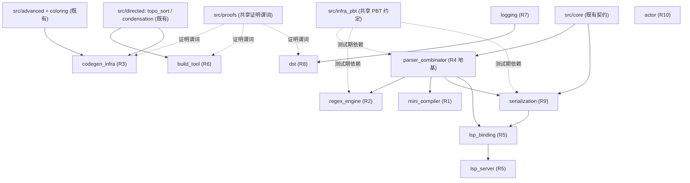
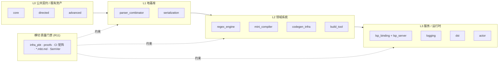

# 设计文档（Design Document）

## 概述（Overview）

本设计文档面向 **moonbit-infra-suite**（以下简称 **Suite**）这一 umbrella 总规划。它的定位与目标是：

- **不**对 10 个基础设施方向逐一钻到底，而是确立一套**统一架构与共享基础设施**，让 10 个方向（对应 requirements.md 的 Requirement 1~10）能够作为**可独立立项、独立发布、独立演进**的子包，在同一 monorepo 与同一质量门禁（Requirement 11）下并行推进。
- 采用 **广度优先（breadth-first）** 的推进策略：先把 10 个方向的**子项目骨架**与模块边界落成，使每个方向都"立得起来、跑得通三后端、有可执行文档与往返性质占位"，质量与算法深度由各自的子 spec 后续迭代。
- 复用 `moonbit-pathfinding` 已验证的工程理念与具体图算法资产（`@directed.topo_sort`、`@directed.condensation` / `@directed.tarjan_scc`、图着色相关资产），把它们作为 Codegen_Infra 与 Build_Tool 的现成地基。

本设计的产出形态是 **umbrella 设计**：它描述跨方向的共享决策（目录结构、PBT 约定、证明谓词约定、三后端 CI 矩阵、可执行文档规范、SemVer/changelog 约定），并为每个方向给出**高层模块边界 + 核心类型签名 + 关键算法流水线**，细节留给各方向独立子 spec。

### 设计范围边界

| 属于本 umbrella 设计 | 留给方向子 spec |
| --- | --- |
| monorepo 多包目录结构与命名规范 | 各方向内部模块的逐函数 API |
| 跨方向共享基础设施（PBT/证明谓词/CI/文档/发布） | 各方向算法的具体实现选型细节 |
| 各方向高层组件划分与核心类型签名 | 各方向完整数据结构与边界条件 |
| 需求 1~11 到方向的可追溯映射 | 各方向逐条验收标准的实现任务 |
| 跨方向通用的错误处理与测试策略 | 各方向独有的领域错误与黄金语料 |
| 里程碑演进路线（先做哪些方向） | 各方向内部的任务拆分 |

### 关键设计决策与理由

1. **monorepo 而非多 repo**：10 个方向共享同一套 CI 矩阵、PBT 工具约定、证明谓词包结构与文档门禁，monorepo 能让"质量门禁"一次定义、全方向复用，避免 10 套重复脚手架漂移。发布时仍按子包独立 SemVer，保留"独立发布"语义。
2. **每个方向是一个可独立发布子包 `src/{方向}`**：沿用 `moonbit-pathfinding` 既有的 `src/{包}` + `moon.pkg` 组织方式，子包之间通过显式 `import` 声明依赖，天然实现"地基包被上层方向复用"。
3. **共享 `proofs` 与 PBT 生成器约定下沉为公共包**：证明谓词与属性测试生成器的"形态"统一，新方向接入零成本。
4. **直接复用 pathfinding 图算法资产**：Build_Tool 的拓扑调度、Codegen_Infra 的寄存器分配图着色，本质都是图算法，复用既有、已被证明谓词覆盖的实现，而不是重写。

---

## 架构（Architecture）

### 仓库与包布局（Monorepo Layout）

Suite 在现有 `Suquster/moonbit-pathfinding` 模块内，以"方向即子包"的方式扩展 `src/` 目录。每个方向是一个或一组 `src/{方向}` 包，拥有自己的 `moon.pkg` 依赖声明、`*_test.mbt` 测试、`*.mbt.md` 可执行文档与 `pkg.generated.mbti` 接口快照。

```
Suquster/moonbit-pathfinding/        # 模块根（moon.mod.json）
├── src/
│   ├── core/                        # [既有] Weight / PathError 等公共契约
│   ├── directed/                    # [既有] topo_sort / condensation / tarjan_scc —— 被复用
│   ├── undirected/ unweighted/ advanced/  # [既有] 图算法资产
│   ├── proofs/                      # [既有→扩展] 共享证明谓词 + 各方向 *_proof.mbt
│   │
│   ├── infra_pbt/                   # [新·共享] PBT 生成器与往返断言公共约定
│   ├── parser_combinator/           # 方向四（地基） —— R4
│   ├── regex_engine/                # 方向二            —— R2
│   ├── serialization/               # 方向九            —— R9
│   ├── mini_compiler/               # 方向一            —— R1
│   ├── codegen_infra/               # 方向三            —— R3（复用图着色）
│   ├── build_tool/                  # 方向六            —— R6（复用 topo_sort/condensation）
│   ├── logging/                     # 方向七            —— R7
│   ├── dst/                         # 方向八            —— R8
│   ├── lsp_binding/  lsp_server/    # 方向五            —— R5
│   └── actor/                       # 方向十            —— R10
│
├── docs/specs-index.md              # 各方向子 spec 索引
└── .kiro/specs/{方向}/              # 各方向独立的 requirements/design/tasks
```

> 命名规范：包路径全小写蛇形（`parser_combinator`）；包内公开 API 通过 `@parser_combinator.X` 形式被引用；每个方向作为发布单元拥有独立 SemVer 标签（见"发布约定"）。

### 包依赖关系（Dependency Graph）

下图展示方向之间以及方向与既有资产、共享基础设施之间的依赖。它本身是一张 DAG，符合 Suite 的分层理念（地基在下、应用在上）。



要点：

- **`parser_combinator`（R4）是公共地基**：被 `regex_engine`、`mini_compiler`、`serialization`（`.proto` 解析）、`lsp_binding`（JSON 解析）复用，因此排在里程碑第一梯队。
- **`serialization`（R9）为 `lsp_binding` 提供 JSON 编解码骨架**，后者再支撑 `lsp_server`。
- **既有图资产复用**：`build_tool` 复用 `@directed.topo_sort` 与 `@directed.condensation`；`codegen_infra` 复用图着色与干涉图资产。
- **共享基础设施（虚线）**：`infra_pbt` 与 `proofs` 是横切的测试/证明期依赖，不进入运行时产物。

### 分层视图（Layered View）



---

## 组件与接口（Components and Interfaces）

本节给出每个方向的高层模块边界、核心类型签名与关键算法流水线。类型签名采用 MoonBit 风格示意，旨在锁定**模块边界与数据流**，具体字段与实现细节留给各方向子 spec。

### 共享基础设施组件

#### infra_pbt —— 统一 PBT 生成器与往返断言约定

- **职责**：为所有方向提供统一的生成器接口形态与高价值性质断言模板（round-trip、invariant、idempotence、metamorphic、differential）。
- **核心接口**：

```moonbit
// 生成器：以确定性种子产生某类型的随机实例（与 DST 共享同一确定性随机源理念）
pub struct Gen[T] { sample : (Rng) -> T }

// 往返断言模板：parse(print(x)) ≡ x / decode(encode(x)) ≡ x
pub fn[T : Eq] round_trip(g : Gen[T], encode : (T) -> Bytes, decode : (Bytes) -> T?) -> Bool

// 不变量断言模板：对生成的每个实例校验布尔谓词
pub fn[T] holds_for_all(g : Gen[T], pred : (T) -> Bool, iters~ : Int = 100) -> Bool
```

- **约定**：每个属性测试最少 100 次迭代；测试注释统一标注 `Feature: moonbit-infra-suite, Property {n}: {text}`。

#### proofs（扩展）—— 共享证明谓词与 `moon prove` 升级路径

- 沿用既有 `src/proofs` 模式：每条后置条件编码为**纯、全（total）** 的 `pub fn ... -> Bool` 谓词，既供运行期测试校验，又作为 `moon prove` 注解的导入目标（包启用 `options("proof-enabled": true)`）。
- 各方向把自己的核心不变量放入 `src/proofs/{方向}_proof.mbt`，复用 `predicates.mbt` 中的通用谓词。

### 方向一：Mini_Compiler（R1）

- **模块边界**：`lexer` → `parser`（构建于 `@parser_combinator`）→ `typer`（类型检查）→ `evaluator`（树遍历解释器）→ `backend`（可选，编译到 wasm/js）。
- **核心类型与流水线**：

```moonbit
pub enum Token { ... }                     // 词法单元
pub enum Ast { ... }                        // 抽象语法树
pub struct Diagnostic { kind : DiagKind; line : Int; col : Int; msg : String }
pub enum TypedAst { ... }                   // 带类型标注 AST

pub fn lex(src : String) -> Result[Array[Token], Diagnostic]
pub fn parse(tokens : Array[Token]) -> Result[Ast, Diagnostic]
pub fn check(ast : Ast) -> Result[TypedAst, Diagnostic]    // 类型不一致 → 类型错误诊断
pub fn eval(ast : TypedAst) -> Value
pub fn print_ast(ast : Ast) -> String      // 配套打印器，支撑 round-trip 性质
pub fn compile(ast : TypedAst, target : Backend) -> Bytes  // WHERE 启用编译后端
```

- **关键决策**：先交付解释器（eval），编译后端（wasm/js）作为后续阶段；文档须明确声明目标语言文法（产生式规则）。

### 方向二：Regex_Engine（R2）

- **模块边界**：`syntax`（正则语法树）→ `parser`（构建于 `@parser_combinator`）→ `nfa`（Thompson 构造）→ `dfa`（子集构造确定化）→ `matcher`（执行）。
- **核心类型与流水线**：

```moonbit
pub enum Regex { Char(Char); Class(CharClass); Star(Regex); Plus(Regex)
                 Opt(Regex); Repeat(Regex, Int, Int?); Concat(Array[Regex])
                 Alt(Array[Regex]); Anchor(AnchorKind); Group(Regex) }

pub fn parse_regex(s : String) -> Result[Regex, ParseError]   // 非法 → 含位置的解析错误
pub fn print_regex(r : Regex) -> String                       // round-trip 配套打印器
pub fn build_nfa(r : Regex) -> Nfa
pub fn to_dfa(nfa : Nfa) -> Dfa
pub fn find(r : Regex, input : String) -> Match?              // 返回是否匹配 + 匹配区间
```

- **关键决策**：NFA 与 DFA 双路径并存，用于差分一致性性质（NFA 结果 == DFA 结果）；PCRE 语料以黄金文件回归。

### 方向三：Codegen_Infra（R3，复用图着色）

- **模块边界**：`reg_alloc`（图着色 + 线性扫描）、`ssa`（支配关系 + φ 插入 + 不变量校验）、`isel`（指令选择 DSL）。
- **核心类型与流水线**：

```moonbit
pub struct InterferenceGraph { ... }        // 复用 @directed / 图着色资产构建
pub enum Location { Reg(Int); Spill(Int) }
pub fn allocate_coloring(g : InterferenceGraph, k : Int) -> Map[Var, Location]  // 复用图着色
pub fn allocate_linear_scan(intervals : Array[LiveInterval], k : Int) -> Map[Var, Location]

pub fn build_ssa(blocks : Array[BasicBlock]) -> SsaProgram         // 含 φ 函数插入
pub fn ssa_single_assignment(p : SsaProgram) -> Bool               // 证明谓词：单赋值不变量
pub fn run_passes(p : SsaProgram, passes : Array[Pass]) -> SsaProgram  // 按序执行，保持不变量

pub fn select(rules : Array[IselRule], ir : IrNode) -> Array[TargetInstr]  // 指令选择 DSL
```

- **复用点**：`InterferenceGraph` 着色直接调用既有图着色资产；干涉不变量（相邻变量不同寄存器）由证明谓词覆盖。

### 方向四：Parser_Combinator（R4，地基）

- **模块边界**：`primitives`（基础原语）、`combinators`（组合子）、`backtrack`（回溯控制）、`lalr`（可选 LALR 生成器）。
- **核心类型与流水线**：

```moonbit
pub struct Parser[T] { run : (Input) -> ParseResult[T] }
pub enum ParseResult[T] { Ok(T, Input); Fail(Pos, expected~ : Array[String]) }

pub fn pchar(c : Char) -> Parser[Char]
pub fn seq[A, B](a : Parser[A], b : Parser[B]) -> Parser[(A, B)]
pub fn alt[T](ps : Array[Parser[T]]) -> Parser[T]      // 择一，失败回溯到分支起点
pub fn many[T](p : Parser[T]) -> Parser[Array[T]]
pub fn many1[T](p : Parser[T]) -> Parser[Array[T]]
pub fn optional[T](p : Parser[T]) -> Parser[T?]

pub fn gen_lalr(grammar : Grammar) -> Result[LalrTable, Array[Conflict]]  // 报告 移进-归约/归约-归约 冲突
```

- **关键决策**：作为 R1/R2/R9/R5 的共同地基，优先级最高；提供 ≥3 个 `*.mbt.md` 端到端可执行解析样例。

### 方向五：LSP_Server / LSP_Binding（R5）

- **模块边界**：`lsp_binding`（协议类型 + JSON-RPC 2.0 分发框架，构建于 `@serialization` 的 JSON 编解码）、`lsp_server`（能力处理器：诊断/补全/定义/悬停）。
- **核心类型与流水线**：

```moonbit
// lsp_binding
pub enum JsonRpcMessage { Request(id~ : Id, method~ : String, params~ : Json)
                          Response(id~ : Id, result~ : Json?, error~ : RpcError?)
                          Notification(method~ : String, params~ : Json) }
pub fn decode_message(bytes : Bytes) -> Result[JsonRpcMessage, RpcError]
pub fn encode_message(msg : JsonRpcMessage) -> Bytes        // round-trip 配套
pub fn dispatch(msg : JsonRpcMessage, router : Router) -> JsonRpcMessage?

// lsp_server
pub fn on_initialize(params : InitializeParams) -> ServerCapabilities  // 声明 诊断/补全/定义/悬停
pub fn on_did_change(doc : TextDocument) -> Array[Diagnostic]          // 重分析 + publishDiagnostics
pub fn on_completion(pos : Position) -> Array[CompletionItem]
pub fn on_definition(pos : Position) -> Location?
pub fn on_hover(pos : Position) -> Hover?
```

- **关键决策**：入门先交付 `lsp_binding`（类型 + JSON-RPC 框架，含编解码往返性质），`lsp_server` 针对某通用 DSL（如 TOML / JSON Schema），不针对 MoonBit 自身；非法消息返回规范错误响应且不终止进程。

### 方向六：Build_Tool（R6，复用 topo_sort/condensation）

- **模块边界**：`graph`（构建图解析）、`dirty`（脏检查）、`schedule`（拓扑 + 并行调度）。
- **核心类型与流水线**：

```moonbit
pub struct BuildGraph { nodes : Array[Target]; edges : Array[(Target, Target)] }
pub fn parse_rules(src : String) -> Result[BuildGraph, ParseError]
pub fn detect_cycle(g : BuildGraph) -> Array[Target]?         // 复用 condensation/tarjan 识别环
pub fn topo_order(g : BuildGraph) -> Result[Array[Target], Cycle]  // 复用 @directed.topo_sort
pub fn is_dirty(t : Target, cache : BuildCache) -> Bool       // mtime + 内容哈希
pub fn schedule(g : BuildGraph, jobs : Int) -> Array[Array[Target]]  // 无依赖任务并行批次
```

- **复用点**：拓扑序直接调用 `@directed.topo_sort`；环检测复用 `@directed.condensation` / `tarjan_scc`；增量空操作（输入未变 → 零重建）是核心验收。

### 方向七：Logging_Library（R7）

- **模块边界**：`event`（结构化字段事件）、`span`（span 树 + 时长）、`context`（跨异步 trace 传播，基于 `moonbitlang/async`）、`format`（JSON 等结构化输出）。
- **核心类型与流水线**：

```moonbit
pub enum Level { Trace; Debug; Info; Warn; Error }
pub struct Event { ts : Int64; level : Level; fields : Map[String, Value] }
pub struct Span { id : SpanId; parent : SpanId?; start : Int64; end : Int64? }

pub fn log(level : Level, fields : Map[String, Value]) -> Unit  // 低于阈值则丢弃
pub fn enter_span(name : String) -> Span                        // 关联父 span，形成 span 树
pub fn exit_span(s : Span) -> Unit                              // 记录持续时长
pub fn format_json(e : Event) -> String                        // 可解析结构化输出（round-trip）
pub fn parse_json_log(s : String) -> Event?
```

### 方向八：DST_Framework（R8）

- **模块边界**：`rng`（种子驱动确定性伪随机源）、`scheduler`（确定性任务选择）、`fault`（故障注入）、`replay`（种子 + 事件轨迹重放）。
- **核心类型与流水线**：

```moonbit
pub struct Rng { seed : UInt64; state : UInt64 }
pub fn rng_new(seed : UInt64) -> Rng
pub fn next(self : Rng) -> UInt64

pub struct Sim { rng : Rng; tasks : Array[Task]; trace : Array[Event] }
pub fn step(self : Sim) -> Sim                  // 依确定性随机源选择下一任务
pub fn inject_fault(self : Sim, policy : FaultPolicy) -> Sim
pub fn run(seed : UInt64, scenario : Scenario) -> SimResult   // 同种子 → 同调度序列 + 同终态
pub fn replay(seed : UInt64, trace : Array[Event]) -> SimResult  // 复现完全相同失败
```

- **关键决策**："同种子 → 同执行"的确定性可重放是核心价值与核心性质；失败时输出可重放种子与事件轨迹。

### 方向九：Serialization_Framework（R9）

- **模块边界**：`wire`（protobuf wire format 编解码）、`proto_parser`（`.proto` 解析，构建于 `@parser_combinator`）、`codegen`（生成 MoonBit 类型 + 编解码代码）。
- **核心类型与流水线**：

```moonbit
pub fn encode(msg : Message) -> Bytes                          // 内存对象 → wire format
pub fn decode(bytes : Bytes, schema : Schema) -> Result[Message, DecodeError]  // 含出错字节偏移
pub fn parse_proto(src : String) -> Result[Schema, ParseError]  // .proto → 模式描述（含行列）
pub fn gen_moonbit(schema : Schema) -> String                  // 代码生成
```

- **关键决策**：`decode(encode(x)) ≡ x` 往返性质为核心；解码失败不产生部分构造对象；以 protobuf 官方 conformance 语料做黄金文件回归。

### 方向十：Actor_Framework（R10）

- **模块边界**：`actor`（生命周期 + 邮箱）、`mailbox`（FIFO 队列 + 空闲挂起）、`supervisor`（错误隔离与监督）。基于 `moonbitlang/async`。
- **核心类型与流水线**：

```moonbit
pub struct ActorRef[M] { id : ActorId; mailbox : Mailbox[M] }
pub fn spawn[S, M](init : S, handle : (S, M) -> S) -> ActorRef[M]  // 返回引用句柄
pub fn send[M](self : ActorRef[M], msg : M) -> Unit               // 追加到邮箱队列
pub fn stop[M](self : ActorRef[M]) -> Unit                        // 处理完当前消息后停止
```

- **关键决策**：单 actor 内串行处理 + 同发送者 FIFO 顺序是核心不变量；未捕获错误终止该 actor 并通知 supervisor，不影响其他 actor；关注 `moonbitlang/async` 上游 API 稳定性（高风险，分阶段）。

---

## 数据模型（Data Models）

本节聚焦 **umbrella 级别跨方向共享的数据模型**；各方向领域专属模型（如完整 AST 节点、protobuf 全部 wire 类型）属于子 spec 范围。

### 跨方向共享：诊断与位置模型

所有含解析阶段的方向（R1/R2/R4/R5/R9）统一使用同形的诊断与位置模型，便于工具与文档一致呈现：

```moonbit
pub struct Position { line : Int; col : Int; offset : Int }
pub struct Span2 { start : Position; end : Position }
pub enum Severity { Error; Warning; Info; Hint }
pub struct Diagnostic {
  severity : Severity
  span : Span2
  code : String          // 稳定错误码，供黄金文件回归
  message : String
}
```

### 跨方向共享：结果与错误模型

- 所有"可能失败"的入口统一返回 `Result[T, E]`，其中 `E` 为方向专属错误枚举，但**均包含定位信息**（字节偏移或行列），以满足各方向"返回含位置的错误且不产生部分构造对象"的验收标准。
- 复用既有 `@core.PathError` 模式：错误是枚举而非字符串，便于测试断言与证明谓词引用。

### 跨方向共享：发布元数据模型

每个方向作为独立发布单元，维护一份发布元数据（驱动 SemVer/changelog 门禁）：

```moonbit
pub struct DirectionRelease {
  name : String              // 方向包名，如 "regex_engine"
  version : String           // SemVer，如 "0.1.0"
  changelog_path : String    // 该方向的 CHANGELOG 路径
  release_ready : Bool       // 测试 + 证明谓词 + 可执行文档全绿才为 true
}
```

### 共享随机源模型（infra_pbt 与 dst 共用）

PBT 生成器与 DST 确定性仿真共用同一"种子驱动伪随机源"理念，保证测试可重放：

```moonbit
pub struct Rng { seed : UInt64; state : UInt64 }   // 线性同余 / xorshift，三后端逐位一致
```


---

## 正确性属性（Correctness Properties）

*属性（property）是指在系统所有合法执行中都应成立的特征或行为——本质上是关于"系统应当做什么"的形式化陈述。属性是连接人类可读规范与机器可验证正确性保证之间的桥梁。*

> 说明：本章列出 umbrella 级别**跨方向共享或方向核心**的属性。它们均以"对任意（For any / For all）"全称量化形式表述，供后续各方向以属性测试（PBT，每条最少 100 次迭代）实现。逐方向的领域专属属性在各自子 spec 中细化。所有"打印再解析 / 编码再解码"的往返性质虽形态一致，但因作用于不同类型而各自保留，以维持对需求的可追溯性。

### Property 1：Mini_Compiler AST 往返

*对任意* 由生成器产生的合法 AST，对其打印再解析应得到等价 AST（`parse(print(ast)) ≡ ast`）；该性质同时蕴含"合法源码能产出 AST"。

**Validates: Requirements 1.2, 1.8**

### Property 2：Mini_Compiler 词法/语法错误条件

*对任意* 注入了词法或语法错误的源码字符串，编译器应返回包含错误类别与行列位置的诊断，且不产生 AST。

**Validates: Requirements 1.3**

### Property 3：Mini_Compiler 求值确定性与作用域不变量

*对任意* 通过类型检查的程序，重复求值应产生相同结果（求值确定性），且作用域绑定一致性证明谓词恒成立。

**Validates: Requirements 1.9**

### Property 4：Regex 语法树往返

*对任意* 受支持子集内的合法正则语法树，对其打印再解析应得到等价语法树（`parse(print(r)) ≡ r`）；该性质同时蕴含"合法正则字符串能解析为语法树"。

**Validates: Requirements 2.2, 2.7**

### Property 5：Regex NFA/DFA 差分一致性

*对任意* 受支持子集内的正则表达式与任意输入字符串，NFA 匹配结果应与 DFA 匹配结果一致（是否匹配与匹配区间均相同）。

**Validates: Requirements 2.6**

### Property 6：Regex 非法表达式错误条件

*对任意* 语法非法的正则字符串，引擎应返回包含错误位置的解析错误，且不构造任何自动机。

**Validates: Requirements 2.3**

### Property 7：寄存器分配干涉不变量

*对任意* 由生成器产生的变量干涉图与可用寄存器数量 K，图着色与线性扫描两种策略输出的分配方案中，任意两个相互干涉的变量都不共享同一寄存器。

**Validates: Requirements 3.3**

### Property 8：SSA 单赋值不变量（建立与保持）

*对任意* 由基本块序列构造的 SSA 程序，每个变量恰有唯一一次静态定义；且在按声明顺序执行任意已注册优化 pass 序列后，该单赋值不变量在每个 pass 之后仍然成立。

**Validates: Requirements 3.5, 3.6**

### Property 9：解析器组合子契约不变量

*对任意* 由组合子构造的解析器与任意输入：成功时返回的"已消费 + 剩余输入"应守恒地等于原输入；失败时不消费输入且失败位置稳定；处于回溯模式时择一分支失败应恢复到分支起始位置。

**Validates: Requirements 4.2, 4.3, 4.4**

### Property 10：解析器组合子语法结构往返

*对任意* 由生成器产生的合法语法结构，对其打印再解析应得到等价结构（`parse(print(x)) ≡ x`）。

**Validates: Requirements 4.5**

### Property 11：JSON-RPC 消息往返

*对任意* 合法的 JSON-RPC 2.0 消息，对其解码再编码应得到语义等价消息（`encode(decode(bytes))` 语义等价）。

**Validates: Requirements 5.9**

### Property 12：LSP_Server 非法消息错误条件

*对任意* 不符合 JSON-RPC 2.0 规范的输入消息，服务器应返回符合规范的错误响应（含错误码与消息），且服务进程不终止。

**Validates: Requirements 5.3**

### Property 13：构建图环检测错误条件

*对任意* 含环的构建图，Build_Tool 应报告构成环的节点序列并拒绝执行构建。

**Validates: Requirements 6.2**

### Property 14：构建调度拓扑不变量

*对任意* 由生成器产生的无环构建图，其调度顺序应满足"任一节点在其所有依赖之后执行"的不变量。

**Validates: Requirements 6.7**

### Property 15：增量构建幂等（空操作）

*对任意* 一次成功构建之后输入文件均未发生变化的场景，再次构建应不执行任何重建动作。

**Validates: Requirements 6.6**

### Property 16：日志级别阈值过滤

*对任意* 日志事件与配置阈值，级别低于阈值的事件应被丢弃，级别不低于阈值的事件应被保留输出。

**Validates: Requirements 7.2**

### Property 17：Span 树与 trace 上下文传播不变量

*对任意* 嵌套 span 序列，每个 span 应正确关联其父 span 形成 span 树，激活 span 内产生的事件应被标注该 span 上下文标识，且跨异步任务边界时子任务保留父任务 trace 标识。

**Validates: Requirements 7.3, 7.4, 7.6**

### Property 18：结构化日志往返

*对任意* 结构化日志事件，序列化再解析应得到等价事件（`parse(format(e)) ≡ e`）。

**Validates: Requirements 7.7**

### Property 19：DST 确定性可重放不变量

*对任意* 给定的随机种子，两次仿真运行应产生逐事件一致的调度序列与最终状态；并且使用某次失败运行所输出的种子与轨迹重放，应复现完全相同的失败。

**Validates: Requirements 8.2, 8.6**

### Property 20：Protobuf 编解码往返

*对任意* 由生成器产生的合法消息对象，编码再解码应等价于原对象（`decode(encode(x)) ≡ x`）。

**Validates: Requirements 9.3**

### Property 21：Protobuf 非法字节错误条件

*对任意* 不符合 protobuf wire format 的字节序列，解码应返回包含出错字节偏移的错误，且不产生部分构造的对象。

**Validates: Requirements 9.4**

### Property 22：Actor 串行与 FIFO 顺序不变量

*对任意* 单一发送者向单一 actor 投递的消息序列，该 actor 应一次仅处理一条消息，并严格按投递顺序处理这些消息。

**Validates: Requirements 10.3, 10.4**

### Property 23：Actor 错误隔离不变量

*对任意* 在处理消息期间抛出未捕获错误的 actor，框架应终止该 actor 并通知其监督者，且不影响其他 actor 的运行。

**Validates: Requirements 10.6**

### Property 24：三后端差分一致性（横切）

*对任意* 方向的同一生成输入集合，在 `wasm-gc`、`native`、`js` 三后端上运行同一测试套件应产生逐一致的输出（含快照）；任一后端的分歧均判定为构建失败。本性质统一承载各方向的三后端一致性验收标准，由 CI 矩阵执行。

**Validates: Requirements 1.10, 2.9, 3.8, 4.8, 6.8, 8.7, 9.9, 11.1**

---

## 错误处理（Error Handling）

Suite 跨方向统一遵循以下错误处理原则：

1. **错误即值，枚举优先**：所有可失败入口返回 `Result[T, E]`，`E` 为方向专属枚举（沿用 `@core.PathError` 风格），不抛字符串异常、不返回哨兵值。便于测试断言与证明谓词引用。
2. **定位信息强制**：解析/解码类错误必须携带定位信息——文本类携带行列（`Position`），二进制类携带字节偏移。对应各方向"返回含位置错误"的验收标准（R1.3、R2.3、R5.3、R6.2、R9.4、R9.6 等）。
3. **失败不产生部分构造对象**：解码/解析失败时返回 `Err` 而非半成品对象（R2.3 不构造自动机、R9.4 不产部分对象、R1.3 不产 AST）。
4. **服务进程不因坏输入终止**：长生命周期服务（LSP_Server、Actor_Framework）对非法输入返回规范错误响应或隔离单个失败单元，进程整体存活（R5.3、R10.6）。
5. **环/冲突显式报告**：图与文法类错误（构建图环 R6.2、LALR 冲突 R4.6）报告导致问题的具体结构（环节点序列、冲突产生式），而非泛化失败。
6. **故障可重放**：DST 失败输出可重放种子与事件轨迹（R8.5/R8.6），使错误诊断可复现。

错误码采用稳定字符串（`Diagnostic.code`），用于黄金文件回归比对，避免错误信息文案变动击穿快照。

---

## 测试策略（Testing Strategy）

Suite 采用**双轨测试 + 横切门禁**策略，统一约束所有方向（Requirement 11）。

### 双轨测试

- **单元测试（示例/边界/错误）**：用于具体示例（R1.6 语义黄金程序、R5.x 各 LSP 能力请求-响应）、边界条件（R1.5 类型冲突、R4.6 文法冲突、R9.6 `.proto` 语法错误）与集成场景。保持精简——广覆盖交给属性测试。
- **属性测试（PBT，全称属性）**：实现"正确性属性"章节的每条属性，**一条属性对应一个属性测试**，每个测试**最少 100 次迭代**，并以注释标注 `Feature: moonbit-infra-suite, Property {编号}: {属性文本}`。生成器与往返/不变量断言模板统一由共享包 `infra_pbt` 提供。

属性测试覆盖的高价值模式与各方向对应关系：

| 模式 | 方向 / 属性 |
| --- | --- |
| 往返（round-trip） | P1(R1.8)、P4(R2.7)、P10(R4.5)、P11(R5.9)、P18(R7.7)、P20(R9.3) |
| 不变量（invariant） | P3、P7、P8、P9、P14、P17、P22、P23 |
| 幂等（idempotence） | P15（增量空操作） |
| 差分一致（differential） | P5（NFA/DFA）、P24（三后端） |
| 确定性可重放 | P19（DST 同种子同执行） |
| 错误条件 | P2、P6、P12、P13、P21 |

### 证明谓词（Executable Proof Predicates）

- 各方向核心后置条件编码为 `src/proofs/{方向}_proof.mbt` 内的**纯、全** `pub fn ... -> Bool` 谓词，复用既有 `predicates.mbt` 模式；包启用 `options("proof-enabled": true)`，预留 `moon prove` 升级路径（R11.2）。
- 运行期由属性测试调用谓词校验；`moon prove` 成熟后注解可直接导入同一谓词，无需重写。

### 黄金文件回归（Golden Files）

- 不适合 PBT 的外部语料以黄金文件回归：Regex 的 PCRE 语料（R2.8）、Serialization 的 protobuf 官方 conformance 语料（R9.8）。这些属 INTEGRATION 测试，1~3 个代表性用例 + 完整语料快照，而非属性测试。

### 三后端一致性门禁（CI 矩阵）

- 在 `wasm-gc` / `native` / `js` 三后端运行同一测试套件（含 `*.mbt.md` 可执行文档），输出分歧（含快照不一致）即构建失败（R11.1，对应 Property 24）。沿用既有 `ci.yml` 的 `matrix.backend = [wasm-gc, js, native]` 结构。

### 可执行文档（Executable Documentation）

- 每个方向提供经 `moon test *.mbt.md` 验证的示例（R11.4）；Parser_Combinator 至少 3 个端到端解析样例（R4.7）。文档示例的输出由快照校验，杜绝文档与实现漂移。

### 不适用 PBT 的部分（明确排除）

- LSP 各能力的具体请求-响应行为（R5.2/5.4/5.6/5.7/5.8）、Mini_Compiler 语义黄金输出（R1.6）→ 示例测试。
- PCRE / protobuf 黄金语料（R2.8 / R9.8）→ 集成 + 黄金文件。
- 证明谓词存在性、SemVer/changelog 元数据、release-ready 聚合门禁（R11.2/11.4/11.5/11.6）→ smoke / CI 聚合检查。

---

## 需求可追溯映射（Requirements Traceability）

### 方向 ↔ 需求 ↔ 包 ↔ 复用资产

| 需求 | 方向 | 子包 | 复用既有资产 | 核心属性 |
| --- | --- | --- | --- | --- |
| R1 | Mini_Compiler | `mini_compiler` | `parser_combinator` | P1, P2, P3, P24 |
| R2 | Regex_Engine | `regex_engine` | `parser_combinator` | P4, P5, P6, P24 |
| R3 | Codegen_Infra | `codegen_infra` | 图着色 / `@directed` 干涉图资产 | P7, P8, P24 |
| R4 | Parser_Combinator | `parser_combinator` | `@core` | P9, P10, P24 |
| R5 | LSP_Server / Binding | `lsp_binding`, `lsp_server` | `serialization`(JSON) | P11, P12 |
| R6 | Build_Tool | `build_tool` | `@directed.topo_sort` / `condensation` | P13, P14, P15, P24 |
| R7 | Logging_Library | `logging` | `moonbitlang/async` | P16, P17, P18 |
| R8 | DST_Framework | `dst` | `infra_pbt` 随机源理念 | P19, P24 |
| R9 | Serialization | `serialization` | `parser_combinator` | P20, P21, P24 |
| R10 | Actor_Framework | `actor` | `moonbitlang/async` | P22, P23 |
| R11 | 横切质量门禁 | `infra_pbt`, `proofs`, CI | 既有 `proofs` / `ci.yml` | P24 + 证明谓词 + `*.mbt.md` + SemVer 门禁 |

### 验收标准覆盖说明

- **PBT 属性覆盖**：R1.2/1.3/1.8/1.9、R2.2/2.3/2.6/2.7、R3.3/3.5/3.6、R4.2/4.3/4.4/4.5、R5.3/5.9、R6.2/6.6/6.7、R7.2/7.3/7.4/7.6/7.7、R8.2/8.6、R9.3/9.4、R10.3/10.4/10.6 → 由 Property 1~23 覆盖。
- **三后端一致性**：R1.10/2.9/3.8/4.8/6.8/8.7/9.9/11.1 → 统一由 Property 24 + CI 矩阵覆盖。
- **示例/边界/集成**：R1.5/1.6、R4.6、R5.2/5.4/5.6/5.7/5.8、R9.6（边界/示例）；R2.8/9.8（黄金文件集成）。
- **门禁/元约束（smoke/CI 聚合）**：R3.1/3.2/3.4/3.7、R4.1/4.7、R5.1/5.5、R6.1/6.3/6.4/6.5、R7.1/7.5、R8.1/8.3/8.4/8.5、R9.1/9.2/9.5/9.7、R10.1/10.2/10.5/10.7、R11.2/11.3/11.4/11.5/11.6 → 由功能实现 + 文档声明 + smoke/集成/聚合门禁覆盖（各方向子 spec 细化）。

> 注：R1.1/R2.1 等"文档声明文法/子集"类标准由各方向文档与 `*.mbt.md` 声明满足，非可执行属性。

---

## 模块化拆分与里程碑演进路线（Milestone Roadmap）

遵循用户的**广度优先**策略：先把 10 个方向的子项目骨架立起来（可编译、跑通三后端、有 round-trip / 不变量占位与 `*.mbt.md`），再逐方向迭代深度。同时尊重依赖关系（地基先行）与风险分级。

### 阶段 0：共享地基（横切，必须先行）

- 落地 `infra_pbt`（统一生成器与断言模板）、扩展 `proofs` 约定、把既有 `ci.yml` 三后端矩阵 + `*.mbt.md` 门禁 + 覆盖率/文档门禁固化为全方向模板、确立各方向 SemVer/changelog 与 release-ready 聚合门禁（R11）。
- 产出：每个方向接入零成本的脚手架与质量门禁。

### 阶段 1：地基库 + 高性价比方向（低风险，优先）

1. **Parser_Combinator（R4，⭐⭐⭐，风险低）** —— 公共地基，R1/R2/R9/R5 都依赖它，必须最先做。
2. **Regex_Engine（R2，⭐⭐⭐，风险中）** —— 性价比高，构建于 Parser_Combinator，往返 + NFA/DFA 差分性质清晰，PCRE 语料现成。
3. **Serialization_Framework（R9，⭐⭐⭐，风险低）** —— 性价比高，往返性质核心，protobuf conformance 黄金语料现成，且为 LSP_Binding 提供 JSON 编解码。

### 阶段 2：复用既有图资产的方向（中风险，地基已具备）

4. **Build_Tool（R6，⭐⭐⭐，风险中）** —— 直接复用 `@directed.topo_sort` / `condensation`，官方点名需要。
5. **Logging_Library（R7，⭐⭐⭐，风险低）** —— 官方点名需要，基于 `moonbitlang/async`，往返 + 不变量性质明确。
6. **Codegen_Infra（R3，⭐⭐⭐⭐，风险中）** —— 复用图着色资产，干涉/SSA 不变量价值高，但难度上升。

### 阶段 3：高难度 / 高风险方向（分阶段，靠后）

7. **DST_Framework（R8，⭐⭐⭐⭐，风险中）** —— 确定性可重放是核心价值，需与 `infra_pbt` 随机源共建。
8. **LSP_Server / LSP_Binding（R5，⭐⭐⭐⭐，风险中高）** —— 先交付 `lsp_binding`（类型 + JSON-RPC + 往返），`lsp_server` 能力分批接入。
9. **Mini_Compiler（R1，⭐⭐⭐⭐，烂尾风险高）** —— 先解释器后编译后端，分阶段；依赖 Parser_Combinator 成熟。
10. **Actor_Framework（R10，⭐⭐⭐⭐，风险中高）** —— 依赖 `moonbitlang/async` 上游 API 稳定性，放最后并持续跟踪上游变动。

### 演进原则

- **骨架先于深度**：每个方向第一版只需满足"可编译 + 三后端通过 + 一条 round-trip/不变量属性 + 一个 `*.mbt.md` 示例 + 独立 SemVer 0.1.0"即视为骨架达成。
- **门禁不打折**：无论方向处于哪个阶段，R11 横切门禁（三后端一致性、证明谓词、可执行文档、独立发布）始终适用；未达标的方向不进入 release-ready。
- **依赖驱动排序**：地基包（Parser_Combinator、Serialization 的 JSON）必须领先于其消费者（Regex / Mini_Compiler / LSP）。

---

## 后续步骤（Next Steps）

本设计为 umbrella 总规划设计，已覆盖统一架构、10 个方向的高层组件与接口、共享基础设施、正确性属性、错误处理、测试策略、需求可追溯映射与里程碑路线。建议的后续推进方式：

- 评审本设计；如发现需求层面的缺口，可返回需求澄清阶段补充。
- 评审通过后，按里程碑路线为各方向逐一创建独立子 spec（`.kiro/specs/{方向}/`）展开各自的 design 与 tasks。
- 本 umbrella spec 的任务阶段（tasks）将由编排器单独发起。
