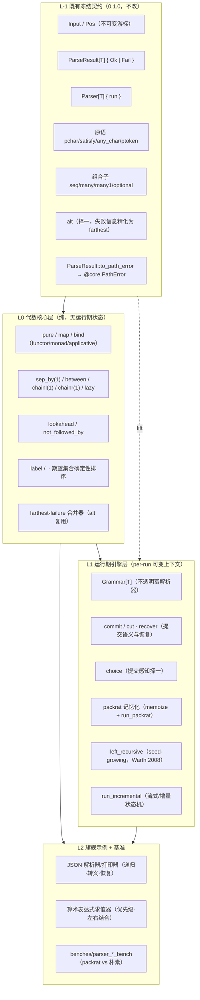

# 设计文档（Design Document）

## 概述（Overview）

本设计文档面向 **Parser_Combinator（方向四）** 在 **🟣 档位 3「业界顶尖（旗舰）」** 目标下的增量深化。它的定位是把已发布的 `0.1.0` 骨架（不可变游标 `Input`、`Pos`、`Parser[T]`、`ParseResult[T]`、原语 `pchar`/`satisfy`/`any_char`/`ptoken`、组合子 `seq`/`alt`/`many`/`many1`/`optional`、以及到 `@core.PathError` 的桥接）演进为一套对标 Haskell `parsec`/`megaparsec` 与 Rust `nom` 的旗舰级解析器组合子库，同时**严格保持向后兼容**（Requirement 14）。

设计的总原则：

- **增量而非重写**：既有公开类型与公开函数的签名、语义、行为全部冻结；所有新能力以**新增 API** 的形式提供（R14.1/14.2/14.5）。
- **分层而非堆砌**：把新能力按「是否需要 per-run 可变运行期上下文」清晰切成两层——**代数核心层**（纯、无运行期状态，承载 R1~R6）与**运行期引擎层**（携带 per-run 可变上下文，承载 R7~R10）。两层通过 `lift` 单向桥接，避免把记忆化/提交/流式的复杂度泄漏进日常代数 API。
- **论文可追溯**：每个关键构造标注其论文出处（Hutton & Meijer 1998、Leijen & Meijer 的 Parsec、Ford 2002 PEG/packrat、Warth et al. 2008 左递归），并与 `parsec`/`megaparsec`/`nom` 做语义对比（R13）。
- **质量门禁内建**：三后端（`wasm-gc`/`js`/`native`）一致性、`@infra_pbt` 属性测试（每条 ≥100 迭代）、`README.mbt.md` 可执行文档、独立 SemVer 与 changelog（R15）。

### 设计范围边界

| 属于本设计 | 留给实现任务（tasks）细化 |
| --- | --- |
| 两层架构与模块/文件划分 | 各 `.mbt` 文件逐函数实现细节 |
| 核心数据结构与签名级接口 | 完整字段、私有辅助函数 |
| 关键算法流水线（farthest-failure / commit / packrat / seed-growing / streaming） | 具体循环边界与微优化 |
| 正确性属性与到需求的映射 | 每条属性测试的生成器实现代码 |
| 三后端可移植性约束与错误处理策略 | 基准的精确输入语料与阈值数值 |
| 与 `parsec`/`megaparsec`/`nom` 的对标结论 | 对标库源码逐行比对 |

### 关键设计决策与理由

1. **冻结公开契约，新增能力旁路扩展**：`Parser[T] { run : (Input) -> ParseResult[T] }`、`ParseResult[T] { Ok | Fail }`、`Input`、`Pos` 的结构与现有方法不动；R1~R6 的代数能力作为返回 `Parser[T]` 的新函数加入，R7~R10 的运行期能力作为新公开类型 `Grammar[T]` 与新入口函数加入。这样既满足 R14，又不让日常用法被记忆化/流式 API 复杂化。
2. **两层切分的判据是「是否需要 per-run 可变状态」**：`map`/`bind`/`pure`/`sep_by`/`chainl1`/`lookahead`/`label` 都是纯组合，无需运行期可变状态，故留在 `Parser[T]` 上；`commit`/`recover`/packrat 记忆化/左递归 seed-growing/流式续解都需要一份**随单次解析运行而生灭**的可变上下文（缓存表、提交水位、左递归栈、分段缓冲与 EOF 标志），故下沉到 `Grammar[T]` 的运行期引擎。
3. **farthest-failure 在公开 `ParseResult` 模型内即可实现**：每个失败分支的 `Fail(pos, expected~)` 已自带各自位置，`alt` 只需在分支间按 `offset` 取最远、并对最远位置上的分支合并期望（R6），无需新类型。代价是 `alt` 失败时**报告的位置**从「分支起点」精化为「最远失败点」——这是唯一一处可观察的行为精化，将在「设计权衡」与「向后兼容」中显式声明。
4. **复用既有 `Input` 不可变游标作为回溯地基**：回溯天然成立（丢弃失败分支产生的新 `Input` 即可），packrat、seed-growing、lookahead 全部受益于「位置即不可变值」这一既有设计，无需引入可变回退栈。
5. **复用 `@infra_pbt` 与 `@release_meta`**：全部新增属性测试以 `@infra_pbt` 的 `Gen`/`Rng`/`holds_for_all`/`round_trip` 实现（R14.4）；发布元数据沿用 `release.mbt` 中 `release_info_with_gates` 的既有模式（R15.5）。

---

## 架构（Architecture）

### 两层架构总览



要点：

- **L-1（冻结）**：0.1.0 全部资产原样保留；`alt` 是唯一在失败诊断位置上做精化的既有函数（成功语义与签名不变）。
- **L0（代数核心层）**：纯组合，全部返回 `Parser[T]`，覆盖 R1（核心代数）、R3（衍生组合子）、R4（前瞻）、R5（label/期望排序）、R6（最远失败）。
- **L1（运行期引擎层）**：新公开不透明类型 `Grammar[T]`，承载需要 per-run 可变上下文的能力——R7（提交/恢复）、R8（packrat）、R9（左递归）、R10（流式）。任意 `Parser[T]` 可经 `lift` 进入该层。
- **L2（示例/基准）**：JSON 与算术两条旗舰主线（R11）贯穿文档、属性测试与基准（R12）。

### 模块与文件划分（File Layout）

在既有子包 `src/parser_combinator/` 内**新增**以下文件（既有 `types.mbt`/`primitives.mbt`/`combinators.mbt`/`release.mbt` 不动或仅做兼容性精化），并在 `benches/` 下新增两个基准包：

```
Suquster/moonbit-pathfinding/
├── src/parser_combinator/
│   ├── types.mbt                 # [既有·冻结] Parser/ParseResult/Input/Pos/to_path_error
│   ├── primitives.mbt            # [既有·冻结] pchar/satisfy/any_char/ptoken
│   ├── combinators.mbt           # [既有] seq/many/many1/optional；alt 失败诊断精化为 farthest
│   ├── algebra.mbt               # [新·L0] pure / map / bind / ap（R1·R2 定律地基）
│   ├── derived.mbt               # [新·L0] sep_by(1)/between/chainl(1)/chainr(1)/lazy（R3）
│   ├── lookahead.mbt             # [新·L0] lookahead / not_followed_by（R4）
│   ├── error_model.mbt           # [新·L0] FarthestError 合并 / label / <?> / 期望排序（R5·R6）
│   ├── engine.mbt                # [新·L1] Grammar[T] / PCtx / Outcome / lift / 运行入口
│   ├── commit.mbt                # [新·L1] commit / cut / recover / choice（R7）
│   ├── packrat.mbt               # [新·L1] memoize / MemoKey / run_packrat / run_naive（R8）
│   ├── left_recursion.mbt        # [新·L1] left_recursive（seed-growing，R9）
│   ├── streaming.mbt             # [新·L1] Cursor / Step / feed / run_incremental（R10）
│   ├── json.mbt                  # [新·L2] Json 值 / 解析器 / 打印器 / 转义解码（R11.1-4,7）
│   ├── arith.mbt                 # [新·L2] Expr AST / 求值器 / 优先级与左右结合（R11.5,6,8）
│   ├── release.mbt               # [既有] SemVer 推进至 0.2.0（R15.5）
│   ├── CHANGELOG.md              # [既有] 追加本次旗舰深化条目
│   ├── README.mbt.md             # [既有·扩充] 可执行文档覆盖五大主题（R15.3）
│   └── *_test.mbt                # [新增] 单元 + 属性测试（algebra/derived/error/commit/
│                                 #         packrat/left_recursion/streaming/json/arith）
└── benches/
    ├── parser_json_bench/        # [新] JSON 解析基准（packrat vs 朴素，递增规模）
    │   ├── moon.pkg
    │   └── parser_json_bench.mbt
    └── parser_arith_bench/       # [新] 算术求值基准（packrat vs 朴素，递增规模）
        ├── moon.pkg
        └── parser_arith_bench.mbt
```

> 约定：包路径全小写蛇形，公开 API 经 `@parser_combinator.X` 引用；`engine.mbt` 中 `PCtx`/`Outcome` 为 `priv`（包内私有），仅 `Grammar[T]` 与运行入口对外公开但 `Grammar` 的内部字段私有（对外不透明），从而把运行期上下文细节封装在引擎内部。

### 依赖关系

```mermaid
graph LR
    core["@core（PathError 等公共契约）"]
    rel["@release_meta（发布元数据）"]
    pbt["@infra_pbt（Gen/Rng/holds_for_all/round_trip）"]
    benchlib["moonbitlang/core/bench"]

    pcsrc["src/parser_combinator（L-1 + L0 + L1 + L2）"]
    jbench["benches/parser_json_bench"]
    abench["benches/parser_arith_bench"]

    core --> pcsrc
    rel --> pcsrc
    pbt -. 测试期依赖 for \"test\" .-> pcsrc
    pcsrc --> jbench
    pcsrc --> abench
    benchlib --> jbench
    benchlib --> abench
```

- 运行时仅依赖 `@core` 与 `@release_meta`（沿用既有 `moon.pkg`）。
- `@infra_pbt` 仅为测试期依赖（`for "test"`），不进入产物（与既有 `moon.pkg` 一致）。
- 两个基准包向下依赖 `src/parser_combinator` 与 `moonbitlang/core/bench`（沿用既有 `benches/*_bench/moon.pkg` 模式）。

---

## 组件与接口（Components and Interfaces）

本节给出签名级接口（MoonBit 风格），重在锁定**模块边界、数据流与算法契约**。除显式标注「精化」者外，既有公开签名一律不变。

### 0. 既有冻结契约（L-1，复述以确立兼容基线）

```moonbit
pub struct Pos { line : Int; col : Int; offset : Int } derive(Eq)
pub struct Input { chars : Array[Char]; pos : Pos }
pub enum ParseResult[T] { Ok(T, Input); Fail(Pos, expected~ : Array[String]) }
pub struct Parser[T] { run : (Input) -> ParseResult[T] }

pub fn pchar(Char) -> Parser[Char]
pub fn satisfy((Char) -> Bool, label~ : String) -> Parser[Char]
pub fn any_char() -> Parser[Char]
pub fn ptoken(String) -> Parser[String]
pub fn[A, B] seq(Parser[A], Parser[B]) -> Parser[(A, B)]
pub fn[T] alt(Array[Parser[T]]) -> Parser[T]            // 失败诊断精化见 §error_model
pub fn[T] many(Parser[T]) -> Parser[Array[T]]
pub fn[T] many1(Parser[T]) -> Parser[Array[T]]
pub fn[T] optional(Parser[T]) -> Parser[T?]
pub fn[T] ParseResult::to_path_error(Self[T]) -> @core.PathError?
```

**兼容承诺**：以上签名与成功路径行为零变更（R14.1/14.2/14.3）。

### 1. 代数核心层 —— functor / monad / applicative（R1、R2）

文件 `algebra.mbt`。把解析器视为「带状态（剩余输入）的计算」，落地单子接口。

```moonbit
/// pure：不消费输入、恒成功、携带给定值（R1.1）。
pub fn[T] pure(value : T) -> Parser[T]

/// map：成功时对产出值施加 f，保持与 p 相同的消费量；p 失败时原样传播且不调用 f（R1.2/1.3）。
pub fn[A, B] map(p : Parser[A], f : (A) -> B) -> Parser[B]

/// bind（单子序列）：p 成功产出 v 后，在 p 的剩余输入上运行 f(v) 返回的解析器；
/// p 失败时原样传播且不调用 f（R1.4/1.5）。
pub fn[A, B] bind(p : Parser[A], f : (A) -> Parser[B]) -> Parser[B]

/// 应用子（applicative apply），由 bind/map 派生，供 applicative 定律校验与点风格组合。
pub fn[A, B] ap(pf : Parser[(A) -> B], pa : Parser[A]) -> Parser[B]

/// 恒失败、不消费输入的解析器（alternative 单位元，供 R2.6 定律与 fail-fast 使用）。
pub fn[T] pfail(expected~ : Array[String]) -> Parser[T]
```

**定律实现策略（R2）**：定律本身不是函数，而是**属性测试目标**。实现端只需保证 `map`/`bind`/`pure`/`alt` 的求值语义满足下列等式，由 §测试策略中的属性测试以 `@infra_pbt.holds_for_all`（≥100 迭代）校验「左右两侧在同一输入上产生逐字段一致的 `ParseResult`」：

- functor：`map(p, id) ≡ p`；`map(p, g∘f) ≡ map(map(p, f), g)`（R2.1/2.2）。
- monad：`bind(pure(a), f) ≡ f(a)`；`bind(p, pure) ≡ p`；`bind(bind(p,f),g) ≡ bind(p, λx. bind(f(x), g))`（R2.3/2.4/2.5）。
- applicative：恒等 `ap(pure(id), v) ≡ v` 与同态 `ap(pure(f), pure(x)) ≡ pure(f(x))`（术语表所列最低集）。
- alternative：`alt([pfail, p]) ≡ p`（左单位元，R2.6）；`alt([alt([p,q]),r]) ≡ alt([p,alt([q,r])])`（PEG 有序选择下结合，R2.7）。

> 实现要点：`map`/`bind` 必须对 `Fail` 分支**透传 `pos` 与 `expected~` 原值**（不重置、不附加），否则会破坏右单位元律与失败传播（R1.3/1.5）。

### 2. 衍生组合子代数（R3）

文件 `derived.mbt`，全部以 L0 原语 + `bind`/`map`/`alt`/`many` 组合而成。

```moonbit
/// 零个或多个被 sep 分隔的 p；零个时产出 [] 且不消费输入（R3.1）。
pub fn[T, S] sep_by(p : Parser[T], sep : Parser[S]) -> Parser[Array[T]]

/// 至少一个 p；无任何 p 时在 p 起始位置失败并报告 p 的期望（R3.2）。
pub fn[T, S] sep_by1(p : Parser[T], sep : Parser[S]) -> Parser[Array[T]]

/// "open body close"，仅产出 body 并消费三者覆盖的全部输入（R3.3）。
pub fn[O, T, C] between(open : Parser[O], body : Parser[T], close : Parser[C]) -> Parser[T]

/// 左结合折叠：operand (op operand)* → 以 op 返回的二元函数自左向右折叠（R3.4）。
pub fn[T] chainl1(operand : Parser[T], op : Parser[(T, T) -> T]) -> Parser[T]

/// 右结合折叠：operand (op operand)* → 自右向左折叠（R3.5）。
pub fn[T] chainr1(operand : Parser[T], op : Parser[(T, T) -> T]) -> Parser[T]

/// 允许空操作数序列：零操作数时产出 default 且不消费输入（R3.6）。
pub fn[T] chainl(operand : Parser[T], op : Parser[(T, T) -> T], default : T) -> Parser[T]
pub fn[T] chainr(operand : Parser[T], op : Parser[(T, T) -> T], default : T) -> Parser[T]

/// 延迟构造：把解析器的构造推迟到首次运行时，打破递归文法的构造期循环依赖（R3.7）。
pub fn[T] lazy(thunk : () -> Parser[T]) -> Parser[T]
```

**算法说明**：
- `sep_by1` = `bind(p, λx. map(many(seq(sep, p)), λrest. [x, ...rest.map(snd)]))`；`sep_by` = `alt([sep_by1(p, sep), pure([])])`。
- `chainl1`：先解析首个 `operand`，再 `many(seq(op, operand))` 收集 `(f, y)` 序列，按 `acc = f(acc, y)` 自左折叠（消除手写左递归，参见 Hutton & Meijer 1998 §「chainl」）。
- `chainr1`：递归式 `operand >>= λx. (op >>= λf. chainr1(operand,op) >>= λy. pure(f(x,y))) <|> pure(x)`，天然右结合。
- `lazy`：`Parser::new(λinput. (thunk()).run(input))`——`thunk` 在每次 `run` 时求值，保证递归引用在构造期不展开（与 `Parser[T]` 是函数包装这一既有设计契合）。

### 3. 前瞻与否定前瞻（R4）

文件 `lookahead.mbt`。

```moonbit
/// 前瞻：p 成功则产出其值但不消费输入；p 失败则在进入位置失败并报告 p 的期望（R4.1/4.2）。
pub fn[T] lookahead(p : Parser[T]) -> Parser[T]

/// 否定前瞻：p 失败则成功产出 Unit 且不消费输入；p 成功则在进入位置失败且不消费输入（R4.3/4.4）。
pub fn[T] not_followed_by(p : Parser[T]) -> Parser[Unit]
```

**算法说明**：二者均利用 `Input` 不可变性——在 `Ok` 分支用**进入时的 `input`** 作为剩余输入返回，从而零消费（R4.5 零消费不变量）。`lookahead` 在 `p` 失败时返回 `Fail(input.pos, expected=<p 的期望>)`；`not_followed_by` 在 `p` 成功时返回 `Fail(input.pos, expected=["非 …"])`。

### 4. 错误模型 —— label / `<?>` / 最远失败合并（R5、R6）

文件 `error_model.mbt`。引入一个**内部**最远失败累加器，并把它用于 `alt`、`label` 与运行入口的诊断生成。

```moonbit
/// 内部：最远失败累加器（不出现在公开 ParseResult 中，仅用于合并逻辑）。
priv struct FarthestError {
  pos : Pos                 // 当前最远失败位置（offset 最大者）
  expected : Array[String]  // 该最远位置上去重合并后的期望集合
}

/// 合并两个失败诊断：取 offset 更大者；offset 相等则并集去重期望（R6.1/6.2/6.3）。
priv fn merge_farthest(a : FarthestError, b : FarthestError) -> FarthestError

/// label / <?>：当 p 在其"起始位置"失败时，用 name 替换期望集合；
/// 若 p 已消费至少一个字符后才失败，则保留 p 原始失败位置与期望（R5.2/5.3）。
pub fn[T] label(p : Parser[T], name : String) -> Parser[T]

/// 期望集合确定性排序：对同一输入的重复解析产生逐元素一致的期望序列（R5.5）。
priv fn normalize_expected(xs : Array[String]) -> Array[String]   // 去重 + 字典序排序
```

**`alt` 失败诊断精化（既有 `alt`，R6 核心）**：现行 `alt` 在全部分支失败时返回 `Fail(input.pos, expected=<全部分支期望拼接>)`。精化后改为：用 `merge_farthest` 在分支间归约——保留 `offset` 最大的失败位置，并仅合并落在该最远位置上的分支期望（去重 + 排序）。这一精化：

- **签名不变、成功路径不变**（PEG 有序选择，首个成功即返回）——满足 R14.2 的「签名与行为」中行为的核心语义部分；
- **唯一可观察变化**是失败时报告的 `pos` 由「分支起点」精化为「最远失败点」，且 `expected` 由「全量拼接」精化为「最远点去重集合」。此变化是**严格信息增益**（位置不早于原值、期望更聚焦），在「向后兼容」小节显式声明，并据此把版本号推进为 `0.2.0`。

**`to_path_error` 桥接（R5.4）**：沿用既有实现——`Fail(pos, expected)` → `@core.PathError::InvalidInput("解析失败于 line:col（offset …），期望 …")`，期望文本取 `normalize_expected` 后的稳定序列。

### 5. 运行期引擎层 —— Grammar 与上下文（R7~R10 公共地基）

文件 `engine.mbt`。这是承载「需要 per-run 可变状态」的能力的内部核心。

```moonbit
/// 不透明富解析器：内部为携带运行期上下文的解析函数（字段私有 → 对外不透明）。
pub struct Grammar[T] {
  priv run_ctx : (PCtx, Input) -> Outcome[T]
}

/// per-run 可变运行期上下文：随单次解析运行而新建、随其结束而丢弃（R8.5 生命周期）。
priv struct PCtx {
  mut farthest : FarthestError      // 全程最远失败累加（R6）
  memo : Map[MemoKey, MemoEntry]    // packrat 缓存（R8），仅本次运行有效
  mut lr_heads : Map[MemoKey, LRHead] // 左递归 seed-growing 头信息（R9）
  source : StreamSource             // 流式输入源 + EOF 标志（R10）
  enable_memo : Bool                // 由运行入口决定（run_packrat vs run_naive）
}

/// 内部结果：在 ParseResult 基础上额外携带"是否已提交"（committed），供 commit/choice 使用。
priv enum Outcome[T] {
  OOk(T, Input)
  OFail(committed~ : Bool)          // 失败详情统一记录在 PCtx.farthest 中
}

/// 把任意 L0 解析器提升进引擎层（lift 后即可叠加 commit/memoize/left_recursive 等）。
pub fn[T] lift(p : Parser[T]) -> Grammar[T]

/// 引擎层的 map/bind/pure，使富解析器同样具备完整代数（与 L0 同名能力对应）。
pub fn[T] Grammar::pure(value : T) -> Grammar[T]
pub fn[A, B] Grammar::map(self : Grammar[A], f : (A) -> B) -> Grammar[B]
pub fn[A, B] Grammar::bind(self : Grammar[A], f : (A) -> Grammar[B]) -> Grammar[B]

/// 运行入口：新建 PCtx 并把内部 Outcome 投影回公开 ParseResult[T]。
pub fn[T] Grammar::run_naive(self : Grammar[T], input : Input) -> ParseResult[T]    // 不启用 memo（朴素参照）
pub fn[T] Grammar::run_packrat(self : Grammar[T], input : Input) -> ParseResult[T]  // 启用 memo（R8.4 入口）
```

**投影规则**：运行入口在解析结束时把 `Outcome` 折叠为 `ParseResult`——`OOk(v, rest)` → `Ok(v, rest)`；`OFail(_)` → `Fail(ctx.farthest.pos, expected=normalize_expected(ctx.farthest.expected))`。`committed` 标志只在引擎内部流转，不泄漏到公开类型，从而保持 `ParseResult` 冻结。

### 6. 提交语义与错误恢复（R7）

文件 `commit.mbt`。

```moonbit
/// commit / cut：进入 commit(p) 且其前缀已匹配后，p 范围内的失败标记为硬失败（R7.1）。
pub fn[T] commit(p : Grammar[T]) -> Grammar[T]
pub let cut : <as commit 的别名>      // 文档别名，语义同 commit

/// 提交感知择一：某分支跨越提交点后失败 → 停止尝试后续分支并传播硬失败（R7.2）；
/// 未跨越提交点失败 → 回溯并继续后续分支（R7.3，软失败可恢复）。
pub fn[T] choice(branches : Array[Grammar[T]]) -> Grammar[T]

/// 错误恢复：p 产生硬失败时记录该错误并把输入推进到 sync 同步点之后以继续解析（R7.4）。
pub fn[T] recover(p : Grammar[T], sync : Grammar[Unit], fallback : T) -> Grammar[T]
```

**算法说明**：
- `commit(p)`：运行 `p`；若 `p` 返回 `OFail(committed=false)`，则改写为 `OFail(committed=true)`（把软失败提升为硬失败）。成功原样透传。
- `choice`：按序运行分支；遇 `OOk` 立即返回；遇 `OFail(committed=true)` 立即停止并向上传播该硬失败（不再尝试后续分支，R7.2）；遇 `OFail(committed=false)` 回溯到分支起点继续下一分支（R7.3）。全部软失败耗尽后返回 `OFail(committed=false)`，诊断已并入 `ctx.farthest`。
- `recover(p, sync, fallback)`：运行 `p`；若得到硬失败，则把该诊断登记进 `ctx`（用于汇总报告），随后从当前位置运行 `many(any_char)`-式扫描直至 `sync` 成功匹配，越过同步点后以 `fallback` 作为该位置的产出继续（局部恢复，R7.4，服务于 R11.4 的 JSON 数组/对象元素级恢复）。
- **提交透明性（R7.5）**：对不含任何提交点的解析器，`commit` 永不会把软失败变为硬失败（因为 `p` 内部从不产生 `committed=true`），故 `commit(p) ≡ p`——由属性测试校验。

### 7. packrat 记忆化（R8）

文件 `packrat.mbt`。

```moonbit
/// 记忆化键：被记忆解析器的稳定标识 × 输入位置（R8.1）。
priv struct MemoKey { node_id : Int; offset : Int } derive(Eq, Hash)

/// 缓存项：一次求值的完整结果（产出/剩余位置/失败诊断），供后续相同查询直接命中（R8.2）。
priv enum MemoEntry { Cached(Outcome[Int /*rest offset 句柄*/]) ; Evaluating /*左递归探测*/ }

/// 标记某富解析器为可记忆，分配唯一 node_id；run_packrat 下其在每个位置至多计算一次（R8.1）。
pub fn[T] memoize(g : Grammar[T]) -> Grammar[T]
```

**算法说明（Ford 2002）**：
- `memoize(g)` 在**构造期**为节点分配一个进程内唯一的 `node_id`（自增计数器）。运行期在 `run_ctx` 入口先以 `MemoKey{node_id, input.offset}` 查 `ctx.memo`：命中则直接返回缓存的 `Outcome`（R8.2 逐字段一致）；未命中则求值、写回缓存、再返回（每个键至多算一次，R8.1）。
- **缓存生命周期（R8.5）**：`ctx.memo` 在 `run_packrat`/`run_naive` 入口随 `PCtx` 新建，运行结束即随之释放；不同输入各自独立的 `PCtx`，缓存互不污染。
- **入口选择（R8.4）**：调用方无需改动文法定义，只需选 `run_packrat`（启用 memo）或 `run_naive`（朴素参照，差分对照用）即可。
- **差分一致性（R8.3）**：`run_packrat` 与 `run_naive` 对同一文法、同一输入产生逐字段一致的 `ParseResult`——由属性测试校验，是 packrat 正确性的核心防线。

> 实现注记（三后端可移植）：`node_id` 自增计数器是**构造期**全局状态，非运行期；为保证三后端一致与可重入，计数器仅影响缓存命中而不影响解析结果（差分一致性是兜底），且属性测试以「同一文法实例」复用同一组 `node_id`。

### 8. 直接左递归 —— seed-growing（R9）

文件 `left_recursion.mbt`，与 packrat 协作实现 Warth et al. 2008 的种子增长（直接左递归）。

```moonbit
/// 左递归头信息：记录某左递归位置当前的"种子"结果与是否仍在增长。
priv struct LRHead { mut seed : Outcome[Unit]; mut growing : Bool }

/// 直接左递归入口：name 为规则名（用于 head 标识），body 接收"规则自身的引用"以书写
/// A := A op b | b 形式的产生式；以 seed-growing 求值，避免无限递归（R9.1~9.4）。
pub fn[T] left_recursive(name : String, body : (Grammar[T]) -> Grammar[T]) -> Grammar[T]
```

**算法说明（Warth 2008，直接左递归）**：
1. 进入位置 `p` 首次求值左递归规则时，在 `ctx.memo` 以 `Evaluating` 占位并把 `LRHead.seed` 初始化为**失败种子**（`OFail`），从而让规则体内对自身的最左递归引用立即命中「失败种子」而不下钻（打破无限递归，R9.1）。
2. **迭代增长**：用当前种子作为「自身引用」的结果运行一次规则体；若新结果比种子**消费了更多输入**（`rest.offset` 更大），则把新结果设为种子并重复；否则停止（R9.2「增长不再消费更多输入时停止」）。
3. 增长收敛后，返回最长匹配结果作为该位置的最终结果并写回缓存。
4. 若基础情形（非递归分支）在起始位置即无可匹配，则种子始终为失败 → 返回携带起始位置与期望的失败，不消费输入（R9.4）。
5. **左结合一致性（R9.3/9.5）**：seed-growing 对 `A := A op b | b` 产生与 `chainl1(b, op)` 一致的左结合结果——由属性测试以 `chainl1` 为参照实现做差分校验。

> 范围声明：本设计仅承诺**直接**左递归（规则直接以自身为最左符号）；间接/相互左递归不在 R9 范围内，文档将显式声明此边界（呼应 R13.6「差异显式声明」）。

### 9. 流式 / 增量输入（R10）

文件 `streaming.mbt`。既有 `Input` 持有完整 `Array[Char]`，不改；流式以**新增**游标与状态机承载。

```moonbit
/// 流式输入源：分段缓冲 + 是否已结束（end-of-input）。
priv struct StreamSource { mut chunks : Array[Char]; mut closed : Bool }

/// 增量游标：对已到达字符的只读视图 + 当前位置（推进返回新游标，保持不可变语义）。
pub struct Cursor { source : StreamSource; pos : Pos }

/// 单步结果：要么完成（Done），要么需要更多输入（NeedMore，携带续解续延）。
pub enum Step[T] {
  Done(ParseResult[T])                 // 已判定：成功或语法失败
  NeedMore((String) -> Step[T])        // 数据不足：喂入下一段后继续（R10.2/10.3）
}

/// 以增量方式运行富解析器：在已到达数据上推进；不足时返回 NeedMore（R10.1/10.2）。
pub fn[T] Grammar::run_incremental(self : Grammar[T], initial : String) -> Step[T]

/// 便捷驱动：把一串分段顺序喂入，得到最终 ParseResult（供分段无关性属性测试）。
pub fn[T] drive(step : Step[T], chunks : Array[String], closed~ : Bool) -> ParseResult[T]
```

**算法说明**：
- 引擎在 `Cursor` 上推进；当某原语在已到达数据末尾仍需更多字符判定且 `source.closed == false` 时，引擎产出 `NeedMore(k)`，其中续延 `k` 捕获「追加新段后从中断位置继续」的状态（R10.3 续解）。
- 当 `source.closed == true`（已标记 end-of-input）且仍不满足解析器，返回 `Done(Fail(pos, expected))`（R10.4），不误报为 NeedMore。
- **分段无关性（R10.5）**：对同一完整输入，任意分段喂入方式得到的最终 `ParseResult` 与一次性喂入完整输入逐字段一致——由属性测试以「随机切点」生成分段方式校验。

### 10. 旗舰示例 —— JSON 解析器与算术求值器（R11）

文件 `json.mbt` 与 `arith.mbt`，构建于 L0/L1。

```moonbit
// ---- json.mbt ----
pub enum Json {
  JNull
  JBool(Bool)
  JNumber(Double)
  JString(String)
  JArray(Array[Json])
  JObject(Array[(String, Json)])
} derive(Eq)

pub fn json_parser() -> Parser[Json]                 // 递归结构（经 lazy 打破构造环）
pub fn json_value_grammar() -> Grammar[Json]         // 引擎版（支持 packrat / 恢复）
pub fn print_json(j : Json) -> String                // 配套打印器（往返用，规范化数值/转义）
pub fn parse_json(src : String) -> Result[Json, @core.PathError]   // 顶层入口（R11.1/11.3）
pub fn parse_json_recover(src : String) -> (Json?, Array[@core.PathError]) // 启用恢复（R11.4）

// ---- arith.mbt ----
pub enum Expr {
  Num(Double)
  Add(Expr, Expr); Sub(Expr, Expr)
  Mul(Expr, Expr); Div(Expr, Expr)
  Pow(Expr, Expr)                                    // 右结合幂运算
} derive(Eq)

pub fn expr_parser() -> Parser[Expr]                 // 优先级：^ > * / > + -
pub fn print_expr(e : Expr) -> String                // 配套打印器（最小括号或完全括号化）
pub fn eval_expr(e : Expr) -> Double                  // 按 AST 直接求值（参照）
pub fn parse_and_eval(src : String) -> Result[Double, @core.PathError]  // R11.5
```

**模块组织与算法**：
- **JSON（R11.1~11.4,11.7）**：`json_parser` 用 `alt`/`between`/`sep_by`/`lazy` 表达对象、数组、字符串、数值、`true`/`false`/`null`；字符串解码处理全部转义（`\" \\ \/ \b \f \n \r \t \uXXXX`，R11.2）；语法错误返回携带行列与期望的诊断且不产生半成品（R11.3，复用 `to_path_error`）；启用恢复版本以 `commit`+`recover`，在数组/对象元素硬失败时同步到下一个 `,` 或闭括号继续（R11.4）。`print_json` 产出可被 `json_parser` 无歧义解析回来的规范文本，支撑 R11.7 往返。
- **算术（R11.5,11.6,11.8）**：分层文法 `expr := term (('+'|'-') term)*`、`term := factor (('*'|'/') factor)*`、`factor := base ('^' factor)?`、`base := number | '(' expr ')'`；`+ -` 与 `* /` 用 `chainl1`（左结合），`^` 用 `chainr1`（右结合），分别对应 R11.6；`parse_and_eval` 解析后调用 `eval_expr`。R9 左递归入口另以 `left_recursive` 表达同一加减层，用于 R9.5 差分。`eval_expr` 是「按 AST 直接求值」的参照，支撑 R11.8 求值一致性。

> 数值域决策（三后端一致性）：JSON 数值与算术结果统一用 `Double`（IEEE-754），并在 `print_json`/`print_expr` 中采用**规范化数值格式**（避免 `-0.0`、`NaN`、指数形式带来的三后端/往返分歧）；生成器只产生有限、可精确往返的数值区间（见 §测试策略），从根上规避浮点格式歧义。

### 11. 性能基准（R12）

新增 `benches/parser_json_bench/` 与 `benches/parser_arith_bench/`，沿用既有 `benches/*_bench` 结构（`moon.pkg` 导入 `moonbitlang/core/bench` 与 `@parser_combinator`）。

- **工作负载（R12.1）**：JSON 解析与算术求值两类，输入规模递增（如嵌套深度/数组长度/表达式长度按几何级数增长）。
- **packrat vs 朴素对比（R12.3）**：同一文法分别以 `run_packrat` 与 `run_naive` 计时，呈现复杂度趋势（回溯型文法上 packrat 趋于线性、朴素趋于超线性）。
- **结果工件（R12.2）**：输出含机器标识、后端目标、输入规模与计时统计的 JSON/Markdown，落地到 `benches/results/`（沿用既有命名与 `latest-*.json/md` 约定）。
- **回归基线（R12.4）**：将新运行与已记基线中位数比较，超出声明容差则给出可审计失败报告（沿用既有 guard 模式）。
- **可复现命令（R12.5）**：基准文档记录运行命令，并在 native 后端前置 `export LIBRARY_PATH=/usr/lib64:/usr/lib`。

---

## 数据模型（Data Models）

### 公开冻结模型（L-1）

`Pos`、`Input`、`ParseResult[T]`、`Parser[T]` 一律保持 0.1.0 定义（见 §组件 0）。

### 新增公开模型（additive）

| 类型 | 用途 | 关键不变量 |
| --- | --- | --- |
| `Grammar[T]`（不透明） | 运行期引擎富解析器 | 内部字段私有；经 `lift` 从 `Parser[T]` 进入 |
| `Cursor` | 流式增量游标 | 推进返回新游标，保持不可变语义 |
| `Step[T]` | 增量单步结果 | `NeedMore` 续延捕获中断状态；`Done` 携带最终 `ParseResult` |
| `Json` | JSON 值（旗舰示例） | `derive(Eq)`，供往返等价比较 |
| `Expr` | 算术 AST（旗舰示例） | `derive(Eq)`，供求值一致性比较 |

### 内部模型（priv，封装于引擎）

| 类型 | 用途 |
| --- | --- |
| `PCtx` | per-run 可变上下文：最远失败、memo 表、左递归头、流式源、memo 开关 |
| `Outcome[T]` | 内部结果：`OOk` / `OFail(committed~)` |
| `FarthestError` | 最远失败位置 + 去重期望集合 |
| `MemoKey` / `MemoEntry` | packrat 缓存键值（`node_id × offset` → 缓存结果 / 求值中占位） |
| `LRHead` | 左递归 seed-growing 的种子与增长状态 |
| `StreamSource` | 分段缓冲 + EOF 标志 |

### 复用既有共享模型

- 错误桥接复用 `@core.PathError`（`ParseResult::to_path_error`，R5.4/R14.3）。
- 属性测试随机源复用 `@infra_pbt.Rng`（种子驱动、三后端逐位一致、可重放）。
- 发布元数据复用 `@release_meta.DirectionRelease`/`QualityGates`（`release.mbt`）。

---

## 算法说明与论文对照（Paper-to-Code）

| 设计构造 | 论文出处 | 对应实现 |
| --- | --- | --- |
| `pure`/`map`/`bind`、`chainl1`/`chainr1`、单子风格组合 | Hutton & Meijer 1998《Monadic Parser Combinators》 | `algebra.mbt`、`derived.mbt` |
| 消费提交语义（`commit`/`cut`）、最远失败 + 期望合并的错误模型、`<?>` 标注 | Leijen & Meijer 的 Parsec 设计 | `commit.mbt`、`error_model.mbt` |
| PEG 有序选择（`alt`/`choice` 首个成功即提交）、packrat 记忆化（位置 × 规则缓存、线性时间） | Ford 2002《Parsing Expression Grammars》/ packrat 论文 | `combinators.mbt`（alt）、`packrat.mbt` |
| 直接左递归 seed-growing（失败种子 + 迭代增长） | Warth et al. 2008《Packrat Parsers Can Support Left Recursion》 | `left_recursion.mbt` |

> 文档（`README.mbt.md` 与示例注释）将逐项标注上述对照（R13.1~13.4），并以可执行示例佐证。

---

## 三后端一致性与可移植性（wasm-gc / js / native）

1. **不依赖平台特定 API**：解析与引擎仅用 MoonBit 核心库（`Array`/`Map`/`String`/`Char`/`Double`），不触碰文件系统/时间/平台随机源；随机性一律来自 `@infra_pbt.Rng`（确定性、可重放）。
2. **字符模型一致**：沿用既有 `Input` 以 `Array[Char]` 承载源文本，`advance` 对 `\n` 行列更新逻辑既有且三后端一致；`\uXXXX` 解码按 Unicode 标量值还原，避免依赖宿主字符串内部编码。
3. **浮点规范化**：JSON/算术统一 `Double`；打印器规范化数值格式、生成器限定可精确往返的数值区间，规避 IEEE-754 在三后端的边角差异（`-0.0`/`NaN`/指数）。
4. **整数与哈希**：`MemoKey` 的 `node_id`/`offset` 用 `Int`；`derive(Hash)` 行为三后端一致；`node_id` 仅影响缓存命中、不影响解析结果（差分一致性兜底）。
5. **CI 矩阵**：沿用既有 `ci.yml` 的 `matrix.backend = [wasm-gc, js, native]`，对全部 `*_test.mbt` 与 `*.mbt.md` 在三后端运行；任一后端输出（含快照）分歧即构建失败（R15.1）。native 运行前置 `export LIBRARY_PATH=/usr/lib64:/usr/lib`（R15.4）。

---

## 错误处理（Error Handling）

1. **错误即值，枚举优先**：解析失败统一以 `ParseResult::Fail(pos, expected~)` 表达；对外桥接为 `@core.PathError`（不抛字符串异常、不返回哨兵）。
2. **定位信息强制**：失败必带 `Pos`（line/col/offset）与非空期望集合（R5.1）；`expected` 经 `normalize_expected` 去重排序，保证同输入重复解析的期望序列逐元素一致（R5.5）。
3. **最远失败优先**：多分支失败时报告推进最远的失败点并合并该点期望（R6），使诊断贴近用户真实意图。
4. **软/硬失败分离**：未跨提交点的软失败可被 `choice`/`alt` 回溯；跨提交点的硬失败立即上抛（R7.2/7.3），并可被 `recover` 局部捕获、同步后继续（R7.4）。
5. **失败不产半成品**：JSON/算术顶层入口在失败时返回 `Err`，绝不返回部分构造的 `Json`/`Expr`（R11.3）。
6. **流式不误报**：数据不足返回 `NeedMore` 而非语法失败；仅在 EOF 且不满足时报失败（R10.2/10.4）。

---


## 正确性属性（Correctness Properties）

*属性（property）是指在系统所有合法执行中都应成立的特征或行为——本质上是关于"系统应当做什么"的形式化陈述。属性是连接人类可读规范与机器可验证正确性保证之间的桥梁。*

> 下列属性以全称量化（"对任意 / 对所有"）形式表述，均以 `@infra_pbt` 的 `holds_for_all`/`round_trip` 实现，每条最少 100 次迭代（R15.2），测试注释统一标注 `Feature: parser-combinator, Property {n}: {text}` 并以 `**Validates: Requirements X.Y**` 链接验收标准。经属性反思（Property Reflection）已合并冗余项：前瞻零消费、最远失败族、提交语义、packrat、左递归、流式、JSON/算术示例均各自归并为最具普适价值的少数属性。

### Property 1：pure 恒成功零消费

*对任意* 值 `v` 与任意输入 `input`，`pure(v).run(input)` 恒为 `Ok(v, input)`，即恒成功、产出 `v`、且剩余输入位置与进入位置相同（零消费）。

**Validates: Requirements 1.1**

### Property 2：map 保持消费量

*对任意* 解析器 `p`、函数 `f` 与输入 `input`，若 `p` 在 `input` 上成功，则 `map(p, f)` 产出 `f(p 的产出值)` 且其剩余输入位置与 `p` 的剩余输入位置逐字段相同。

**Validates: Requirements 1.2**

### Property 3：map / bind 失败透传且不调用续延

*对任意* 在 `input` 上失败的解析器 `p`、函数 `f`，`map(p, f)` 与 `bind(p, f)` 均返回与 `p` 逐字段一致的失败（相同失败位置与期望集合），且 `f` 不被调用。

**Validates: Requirements 1.3, 1.5**

### Property 4：Functor 恒等律

*对任意* 由生成器产生的解析器 `p` 与输入，`map(p, fn(x){x})` 与 `p` 产生逐字段一致的解析结果。

**Validates: Requirements 2.1**

### Property 5：Functor 复合律

*对任意* 由生成器产生的解析器 `p`、函数 `f`、`g` 与输入，`map(p, fn(x){g(f(x))})` 与 `map(map(p, f), g)` 产生逐字段一致的解析结果。

**Validates: Requirements 2.2**

### Property 6：Monad 左单位元律

*对任意* 由生成器产生的值 `a`、函数 `f` 与输入，`bind(pure(a), f)` 与 `f(a)` 产生逐字段一致的解析结果。

**Validates: Requirements 2.3, 1.4**

### Property 7：Monad 右单位元律

*对任意* 由生成器产生的解析器 `p` 与输入，`bind(p, pure)` 与 `p` 产生逐字段一致的解析结果。

**Validates: Requirements 2.4**

### Property 8：Monad 结合律

*对任意* 由生成器产生的解析器 `p`、函数 `f`、`g` 与输入，`bind(bind(p, f), g)` 与 `bind(p, fn(x){bind(f(x), g)})` 产生逐字段一致的解析结果。

**Validates: Requirements 2.5**

### Property 9：Alternative 左单位元律

*对任意* 由生成器产生的解析器 `p` 与输入，`alt([pfail, p])`（`pfail` 为恒失败且不消费输入的解析器）与 `p` 产生逐字段一致的解析结果。

**Validates: Requirements 2.6**

### Property 10：Alternative 结合律（PEG 有序选择）

*对任意* 由生成器产生的解析器三元组 `p`、`q`、`r` 与输入，`alt([alt([p, q]), r])` 与 `alt([p, alt([q, r])])` 产生逐字段一致的解析结果。

**Validates: Requirements 2.7**

### Property 11：sep_by 家族收集语义

*对任意* 由生成器产生的元素序列与分隔符，`sep_by(p, sep)` 收集出的产出数组等于该元素序列（零元素时为空数组且不消费输入）；`sep_by1(p, sep)` 在零元素输入上于起始位置失败、在一个或多个元素时收集结果与 `sep_by` 一致。

**Validates: Requirements 3.1, 3.2**

### Property 12：between 仅产出主体并消费三段

*对任意* 由生成器产生的 `open`/`body`/`close` 片段拼接而成的输入，`between(open, body, close)` 产出 `body` 的值，且剩余输入位置落在 `close` 之后（消费三者覆盖的全部输入）。

**Validates: Requirements 3.3**

### Property 13：chainl1 左结合一致

*对任意* 由生成器产生的操作数序列与左结合二元运算符序列，`chainl1(operand, op)` 的折叠结果等于对同一序列自左向右显式折叠的参照结果。

**Validates: Requirements 3.4**

### Property 14：chainr1 右结合一致

*对任意* 由生成器产生的操作数序列与右结合二元运算符序列，`chainr1(operand, op)` 的折叠结果等于对同一序列自右向左显式折叠的参照结果。

**Validates: Requirements 3.5**

### Property 15：前瞻与否定前瞻零消费不变量

*对任意* 由生成器产生的解析器 `p` 与输入，`lookahead(p)` 与 `not_followed_by(p)` 运行后的剩余输入偏移恒等于进入时的输入偏移；且 `lookahead(p)` 成功当且仅当 `p` 成功、`not_followed_by(p)` 成功当且仅当 `p` 失败。

**Validates: Requirements 4.1, 4.2, 4.3, 4.4, 4.5**

### Property 16：失败结构完整性

*对任意* 由生成器产生的在某输入上失败的解析器，其结果为 `Fail(pos, expected~)`，其中 `pos` 携带 `line`/`col`/`offset`、`expected` 为非空集合。

**Validates: Requirements 5.1**

### Property 17：label 位置敏感改写

*对任意* 由生成器产生的解析器 `p` 与输入：当 `p` 在其起始位置失败时，`label(p, name)` 的期望集合等于 `[name]`；当 `p` 已消费至少一个字符后失败时，`label(p, name)` 保留 `p` 原始的失败位置与期望集合。

**Validates: Requirements 5.2, 5.3**

### Property 18：期望集合确定性顺序

*对任意* 由生成器产生的失败场景，对同一输入重复解析两次所得的期望集合序列逐元素一致。

**Validates: Requirements 5.5**

### Property 19：最远失败位置与期望合并不变量

*对任意* 由生成器产生的解析器列表与输入，`alt` 在全部分支失败时报告的失败位置不早于任一分支单独失败时的位置；当多个分支在该最远位置失败时，报告的期望集合为这些分支期望的去重并集，且较早位置分支的期望被舍弃。

**Validates: Requirements 6.1, 6.2, 6.3, 6.4**

### Property 20：错误位置单调性

*对任意* 由生成器产生的解析器与输入，所报告的失败位置不早于该解析器在该输入上任一成功子解析所消费前缀的末尾位置。

**Validates: Requirements 6.5**

### Property 21：提交感知择一语义

*对任意* 由生成器产生的、含提交点的分支序列与输入：当某分支在跨越提交点之后失败时，`choice` 停止尝试后续分支并向上传播硬失败；当某分支在跨越提交点之前失败时，`choice` 回溯到分支起始位置并继续尝试后续分支。

**Validates: Requirements 7.1, 7.2, 7.3**

### Property 22：提交透明性

*对任意* 由生成器产生的、不含任何提交点的富解析器 `g` 与输入，`commit(g)` 与 `g` 产生逐字段一致的解析结果。

**Validates: Requirements 7.5**

### Property 23：packrat 与朴素差分一致性

*对任意* 由生成器产生的富解析器与输入，`run_packrat` 与 `run_naive` 在同一输入上产生逐字段一致的解析结果（含产出值、剩余输入位置与失败诊断）；并且在同一输入位置以同一被记忆解析器重复求值返回逐字段一致的结果。

**Validates: Requirements 8.1, 8.2, 8.3**

### Property 24：packrat 缓存隔离

*对任意* 由生成器产生的两段不同输入，连续以 `run_packrat` 解析所得结果分别等于对各自输入独立运行 `run_packrat` 的结果（缓存生命周期限定于单次运行，不同输入互不污染）。

**Validates: Requirements 8.5**

### Property 25：左递归与 chainl1 差分一致

*对任意* 由生成器产生的左结合运算符表达式输入，经 `left_recursive` 定义的直接左递归解析器与 `chainl1` 参照实现产生逐字段一致的求值结果（在有限步内收敛于最长匹配）。

**Validates: Requirements 9.1, 9.2, 9.3, 9.5**

### Property 26：流式分段无关性

*对任意* 由生成器产生的完整输入及其任意分段方式，增量喂入（`run_incremental` + 逐段 `drive`）所得的最终解析结果与一次性喂入完整输入的解析结果逐字段一致。

**Validates: Requirements 10.1, 10.3, 10.5**

### Property 27：需要更多输入而非误报失败

*对任意* 由生成器产生的"某合法完整输入的真前缀且尚未标记结束"的分段，`run_incremental` 返回 `NeedMore` 续延，而非报告语法失败。

**Validates: Requirements 10.2**

### Property 28：JSON 往返

*对任意* 由生成器产生的合法 `Json` 值 `x`，解析其打印结果得到等价 JSON 值（`parse_json(print_json(x))` 等于 `Some(x)`）。

**Validates: Requirements 11.1, 11.7**

### Property 29：JSON 转义解码

*对任意* 由生成器产生的、含转义序列（`\" \\ \/ \b \f \n \r \t \uXXXX`）的合法 JSON 字符串字面量，解析器将其解码为对应字符序列。

**Validates: Requirements 11.2**

### Property 30：JSON 语法错误诊断且不产半成品

*对任意* 由生成器产生的、注入了语法错误的 JSON 文本，解析返回携带失败行列位置与期望符号的诊断，且不返回部分构造的 `Json` 值。

**Validates: Requirements 11.3**

### Property 31：算术求值一致性

*对任意* 由生成器产生的合法算术表达式 AST `x`（其结构编码了运算符优先级与左/右结合性），对其打印形式 `parse_and_eval(print_expr(x))` 求值得到与按 AST 直接求值 `eval_expr(x)` 一致的数值结果。

**Validates: Requirements 11.5, 11.6, 11.8**

### Property 32：三后端差分一致性（横切）

*对任意* 上述属性的同一生成输入集合，在 `wasm-gc`、`js`、`native` 三后端上运行同一测试套件产生逐一致的输出（含快照）；任一后端的分歧均判定为构建失败。由 CI 矩阵承载。

**Validates: Requirements 15.1**

---

## 测试策略（Testing Strategy）

采用**双轨测试 + 横切门禁**，统一约束本方向（Requirement 15）。

### 双轨测试

- **属性测试（PBT）**：实现「正确性属性」章节 Property 1~32，**一条属性对应一个属性测试**，每个测试**最少 100 次迭代**，注释标注 `Feature: parser-combinator, Property {n}: {text}`，并以 `**Validates: Requirements X.Y**` 链接。模板统一来自 `@infra_pbt`：
  - `holds_for_all(gen, pred, iters~)`：用于定律与不变量（Property 1~27、29~31）。
  - `round_trip(gen, encode, decode)`：用于 JSON 往返（Property 28，沿用既有 `prop_roundtrip_test.mbt` 的 `Bytes` 桥接模式）。
- **单元/示例/边界测试**：用于确定性映射与边界（`to_path_error` 桥接 R5.4、`chainl/chainr` 空序列 R3.6、左递归无基础情形 R9.4、流式 EOF 失败 R10.4、`recover` 同步恢复 R7.4/R11.4、算术优先级具体样例如 `8-3-2==3`、`2^3^2==512`、`2+3*4==14`、`lazy` 递归文法不发散 R3.7），以及 JSON/算术的代表性黄金样例。保持精简，广覆盖交给属性测试。

### 生成器策略（@infra_pbt.Gen / Rng）

- **解析器生成器 `gen_parser`**：在一个**有限组合子字母表**（`pchar`/`satisfy`/`pure`/`pfail`/`map`/`bind`/`alt`/`seq`/`many`）上按受限深度采样，产出 `Parser[T]`；配套 `gen_input` 在同一字符集上采样输入，使生成的解析器与输入「有意义地」交互，从而真正触发定律的两侧分支。
- **JSON 生成器 `gen_json`**：深度受限地采样 `Json`（对象/数组长度有界、字符串含随机转义、数值限定为可精确往返的有限区间），供 Property 28/29。
- **算术 AST 生成器 `gen_expr`**：深度受限采样 `Expr`，数值限定可精确表示区间、避免除零（除法分母非零或采用安全语义），供 Property 31。
- **分段方式生成器**：对完整输入采样随机切点集合，生成各式分段序列，供 Property 26。
- 全部生成器复用 `@infra_pbt.Rng`（种子驱动、三后端逐位一致、可重放）。

### 差分与参照实现

- **packrat ↔ 朴素**（Property 23）：`run_packrat` 与 `run_naive` 互为差分参照。
- **左递归 ↔ chainl1**（Property 25）：`chainl1` 是 seed-growing 左递归的参照实现。
- **流式 ↔ 一次性**（Property 26）：一次性喂入完整输入是分段喂入的参照。

### 不适用 PBT 的部分（明确排除）

- 基准包/工件/基线/可复现命令（R12）、paper-to-code 文档与开源对标（R13）、向后兼容签名约束（R14）、SemVer/changelog/release-ready 聚合门禁（R15.5/15.6）→ smoke / 集成 / 文档校验 / mbti 快照。
- 三后端一致性（R15.1）→ 由 CI 矩阵承载（对应 Property 32），而非单测内 100 迭代。

### 横切门禁

- **三后端 CI 矩阵**：`wasm-gc`/`js`/`native` 运行同一套件（含 `*.mbt.md`），输出/快照分歧即失败；native 前置 `export LIBRARY_PATH=/usr/lib64:/usr/lib`（R15.1/15.4）。
- **可执行文档**：`README.mbt.md` 扩充覆盖核心代数、衍生组合子、错误处理与两个旗舰示例，经 `moon test *.mbt.md` 验证（R15.3）。
- **发布门禁**：`release.mbt` 版本推进至 `0.2.0` 并追加 `CHANGELOG.md` 条目；`release_info_with_gates` 在测试/文档门禁未全绿时令 `release_ready=false`（R15.5/15.6）。

---

## 设计权衡与开源对标（Trade-offs & Comparison）

### 与 parsec / megaparsec / nom 的语义对比

| 维度 | 本库（Parser_Combinator） | Haskell parsec / megaparsec | Rust nom |
| --- | --- | --- | --- |
| 默认回溯 | **PEG 风格全回溯**（`Input` 不可变，分支失败零成本回退） | 默认**不回溯已消费输入**，需 `try` 才回溯 | 组合子显式控制，`alt` 在错误类型上区分可恢复/不可恢复 |
| 提交语义 | 显式 `commit`/`cut`：软失败可回溯、硬失败上抛（引擎层 `choice` 感知） | parsec 以「是否消费输入」隐式决定提交；`try` 撤销消费 | 通过 `Err::Error`（可恢复）与 `Err::Failure`（不可恢复）区分 |
| 错误模型 | 最远失败位置 + 同位置期望去重合并 + `label`/`<?>` | megaparsec 富错误（最远失败、期望集合、`<?>`）——本库与之最接近 | `nom` 默认轻量错误，富错误经 `VerboseError` 叠加 |
| 左递归 | 直接左递归经 seed-growing（Warth 2008）支持 | 不支持（需手动改写为 `chainl1` 等） | 不支持（同样需改写） |
| 记忆化 | 可选 packrat（`run_packrat` 入口，文法定义不变） | 默认无 packrat | 默认无 packrat |
| 流式 | `run_incremental` + `NeedMore` 续延 | megaparsec/attoparsec 提供流式/增量（attoparsec 的 `Partial`） | nom 经 `Incomplete` 表达需要更多输入——本库 `NeedMore` 与之同理念 |

### 关键权衡

1. **PEG 全回溯 vs 性能**：全回溯带来组合直觉但最坏指数级；以可选 packrat（R8）把回溯型文法降为线性，调用方按需在 `run_packrat`/`run_naive` 间选择，兼顾直觉与性能。
2. **两层（Parser/Grammar）vs 单层**：单层会把记忆化/提交/流式的运行期上下文泄漏进日常 API；两层切分让 R1~R6 保持纯净易用、R7~R10 的复杂度封装在引擎内，且经 `lift` 单向桥接零摩擦升级。代价是用户需理解「何时 `lift`」——以文档与示例缓解。
3. **`alt` 失败诊断精化 vs 严格行为冻结**：为满足 R6 最远失败，`alt` 的失败**位置**从分支起点精化为最远点（成功路径与签名不变）。这是 0.1.0 → 0.2.0 唯一可观察行为变化，属严格信息增益；据此以 minor 版本推进并在 `CHANGELOG.md` 显式声明（R13.6 差异显式化）。
4. **仅直接左递归 vs 间接左递归**：seed-growing 仅承诺直接左递归（R9 范围），间接/相互左递归显式排除，避免引入头/卷曲（head/involved-set）的复杂簿记；文档显式声明此边界。
5. **浮点数值域 vs 任意精度**：JSON/算术统一 `Double` 并规范化打印，换取三后端一致与往返可判定；生成器限定可精确往返区间以规避 IEEE-754 边角，代价是不覆盖任意大整数/高精度小数（可作为后续扩展）。

---

## 需求可追溯映射（Requirements Traceability）

### 需求 ↔ 组件/文件 ↔ 属性

| 需求 | 主题 | 组件/文件 | 关键属性 |
| --- | --- | --- | --- |
| R1 | 核心代数 pure/map/bind | `algebra.mbt` | P1, P2, P3, P6 |
| R2 | functor/monad/applicative/alternative 定律 | `algebra.mbt`（测试） | P4, P5, P6, P7, P8, P9, P10 |
| R3 | 衍生组合子 | `derived.mbt` | P11, P12, P13, P14（R3.6/3.7 示例/边界） |
| R4 | 前瞻/否定前瞻 | `lookahead.mbt` | P15 |
| R5 | label / 期望排序 / 桥接 | `error_model.mbt` | P16, P17, P18（R5.4 示例） |
| R6 | 最远失败 + 单调性 | `error_model.mbt`、`combinators.mbt`(alt) | P19, P20 |
| R7 | 提交语义 / 恢复 | `commit.mbt`、`engine.mbt` | P21, P22（R7.4 示例） |
| R8 | packrat 记忆化 | `packrat.mbt`、`engine.mbt` | P23, P24（R8.4 smoke） |
| R9 | 直接左递归 seed-growing | `left_recursion.mbt` | P25（R9.4 边界） |
| R10 | 流式/增量输入 | `streaming.mbt` | P26, P27（R10.4 边界） |
| R11 | JSON + 算术旗舰示例 | `json.mbt`、`arith.mbt` | P28, P29, P30, P31（R11.4/11.6 示例） |
| R12 | 性能基准 | `benches/parser_json_bench`、`benches/parser_arith_bench` | smoke/集成 + guard 基线 |
| R13 | paper-to-code / 对标 | `README.mbt.md`、注释 | 文档声明 |
| R14 | 向后兼容 / 复用 | `types.mbt`/`primitives.mbt`/`combinators.mbt`（冻结） | mbti 快照 + 既有测试 |
| R15 | 工程质量门禁 | CI、`release.mbt`、`README.mbt.md` | P32 + 文档/发布门禁 |

### 验收标准覆盖说明

- **PBT 属性覆盖**：R1.1/1.2/1.3/1.4/1.5、R2.1~2.7、R3.1~3.5、R4.1~4.5、R5.1/5.2/5.3/5.5、R6.1~6.5、R7.1/7.2/7.3/7.5、R8.1/8.2/8.3/8.5、R9.1/9.2/9.3/9.5、R10.1/10.2/10.3/10.5、R11.1/11.2/11.3/11.5/11.6/11.7/11.8、R15.1 → 由 Property 1~32 覆盖。
- **示例/边界**：R3.6/3.7、R5.4、R7.4、R9.4、R10.4、R11.4/11.6（具体优先级样例）。
- **Smoke/元约束**：R1.6、R8.4、R12.*、R13.*、R14.*、R15.2/15.3/15.4/15.5/15.6 → 由功能实现 + mbti 快照 + 文档声明 + 集成/聚合门禁覆盖。

---

## 后续步骤（Next Steps）

本设计已覆盖两层架构、模块/文件划分、签名级接口、核心数据结构、关键算法（farthest-failure / commit / packrat / seed-growing / streaming）、论文对照、三后端可移植性、错误处理、正确性属性（Property 1~32）、测试策略、设计权衡与开源对标、以及到需求的可追溯映射。

- 评审本设计；如发现需求层面的缺口，可返回需求阶段补充。
- 评审通过后，由编排器单独发起任务阶段（tasks），把 L0/L1/L2 各文件与基准包、属性测试拆解为可执行的实现任务。
