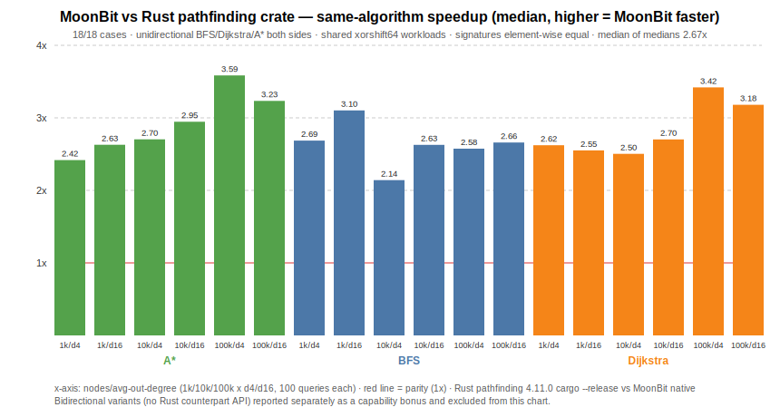

# moonbit-pathfinding

> 🌐 Language: **English** · [简体中文](./README.zh-CN.md)

<!-- Tier-1 6 badges (per tasks.md 10.1): License / CI / Version / mooncakes.io / Playground / Formally verified -->
[](./LICENSE)
[](https://github.com/Suquster/moonbit-pathfinding/actions/workflows/ci.yml)
[](./CHANGELOG.md)
[](https://mooncakes.io/docs/Suquster/moonbit-pathfinding)
[](https://suquster.github.io/moonbit-pathfinding/)
[](#formal-verification)

[](https://moonbitlang.github.io/OSC2026/)

> ⚠️ **This is the static README.** The canonical, always-up-to-date README is
> [**README.mbt.md**](./README.mbt.md), which runs as executable tests
> via `moon test README.mbt.md` — every code example is verified on every CI run.
> 本文件仅为静态副本，最新权威版本请查看 [README.mbt.md](./README.mbt.md)（可执行文档，示例即测试）。

> **A MoonBit-native pathfinding and graph algorithms library built for rigorous engineering.**
>
> A production-grade pathfinding and graph algorithms library for **MoonBit**,
> built to compete with Rust's `pathfinding` crate on the axes that matter:
> **executable proof predicates**, **executable Markdown documentation**,
> **multi-backend consistency** (wasm-gc / native / js), and
> reproducible validation scripts.

---

## Why this project (three stories)

1. **Filling an ecosystem gap** — a production-grade pathfinding / graph
   algorithms library for MoonBit: 38+ algorithms (BFS → A\* → JPS → ALT →
   CH → Hub Labels → PHAST) plus 20 infra directions, published on
   [mooncakes.io](https://mooncakes.io/docs/Suquster/moonbit-pathfinding)
   with a [live in-browser playground](https://suquster.github.io/moonbit-pathfinding/).
2. **An engineering benchmark for the ecosystem** — 3331 tests across four
   backends (wasm-gc / native / js / wasm), executable proof predicates,
   executable README (`moon test README.mbt.md`), DST + differential PBT,
   zero-warning `--deny-warn` CI gates, and a published
   [head-to-head vs Rust's `pathfinding` crate](./benches/results/latest-rust-comparison.md)
   (≈2.7× median same-algorithm speedup; bidirectional variants reported
   separately).
3. **Real data, end to end** — real OSM road networks (Beijing / Xiamen)
   drive the point-to-point hierarchy (bidirectional Dijkstra → ALT → CH →
   HL, up to 13279×) with full cross-validation, all reproducible from
   checked-in scripts and artifacts.

**Downstream usage**: two independent repositories consume the published
mooncakes.io package (`moon add Suquster/moonbit-pathfinding`) as a regular
dependency, each with its own tests and CI:
[`Suquster/moonbit-pathfinding-demo`](https://github.com/Suquster/moonbit-pathfinding-demo)
(a warehouse robot route planner) and
[`Suquster/moonbit-maze`](https://github.com/Suquster/moonbit-maze)
(a perfect-maze generator + A\* solver CLI with a Dijkstra cross-check
oracle).

---

## Ported from

本库 **API 哲学** 参考自 Rust 社区的
[`pathfinding` crate](https://github.com/evenfurther/pathfinding)（v4.15.0，
双许可 MIT OR Apache-2.0）。核心借鉴:

- **"Successor function" 极简设计** — 算法不强制图数据结构,用户通过
  `fn(N) -> Array[N]` 或 `fn(N) -> Array[(N, W)]` 定义邻居关系。
- **泛型节点类型** — `N : Eq + Hash` 足够,无需 `Ord` 约束。
- **返回类型风格** — `Option[(Array[N], W)]` 表示"可能无解的带权最短路"。

但**所有算法实现均独立派生自原始论文**,不是逐行移植。本库在此基础上**原
创贡献**:

1. **Executable proof predicates** for BFS/Dijkstra contracts, with runtime
   regression tests today and a clear `moon prove` upgrade path.
2. **Executable README examples** via `moon test README.mbt.md`, so examples
   are compiled and snapshot-checked instead of drifting.
3. **四后端一致性** — wasm-gc / native / js / wasm 差分测试 CI 门禁 + WASI 交付门禁 + wasm 组件模型交付门禁。
4. **AI-agent-friendly successor-function APIs** and graph input guides that
   keep callers free from a forced graph data structure.

See [docs/ECOSYSTEM_COMPARISON.md](docs/ECOSYSTEM_COMPARISON.md) for a
per-domain comparison with existing MoonBit ecosystem packages (pathfinding,
hash, compress, TOML, diff, etc.) and the tradeoffs behind each choice, and
[docs/STRATEGY_CLOSURE.md](docs/STRATEGY_CLOSURE.md) for the project's
six-layer closure positioning (pathfinding ⊂ graph algorithms ⊂ verification
infra ⊂ general infra ⊂ language tooling ⊂ AI-native software factory).

---

## Quick Start

### 1. 安装依赖

在你的 MoonBit 项目根目录执行:

```powershell
moon add Suquster/moonbit-pathfinding
```

在需要调用算法的包的 `moon.pkg` 里声明导入:

```moonbit
import {
  "Suquster/moonbit-pathfinding/src/directed" @directed,
}
```

> More copy-ready import patterns are in [AI_AGENT_USAGE.md](./docs/AI_AGENT_USAGE.md).

### 2. Dijkstra 最短路 · 5 节点小图

考虑下面的有向带权图 (节点 `A..E` 对应索引 `0..4`):

```
边列表 (起点 → 终点, 权重):
  A(0) → B(1) : 1
  A(0) → C(2) : 4
  B(1) → C(2) : 2
  B(1) → E(4) : 3
  C(2) → D(3) : 1
  E(4) → D(3) : 2

目标: 求 A → D 的最短路径。
```

三条候选路径:

| # | 路径          | 代价计算         | 总代价 |
|---|---------------|------------------|-------:|
| 1 | A → B → C → D | `1 + 2 + 1`      | **4** ✅ |
| 2 | A → C → D     | `4 + 1`          | 5 |
| 3 | A → B → E → D | `1 + 3 + 2`      | 6 |

完整可运行示例 (`cmd/main/main.mbt`):

```moonbit
fn main {
  // 邻接表: 索引 0..4 对应节点 A..E
  // 每个元素为 (邻居节点, 边权)
  let adj : Array[Array[(Int, Int)]] = [
    [(1, 1), (2, 4)], // A: A->B(1), A->C(4)
    [(2, 2), (4, 3)], // B: B->C(2), B->E(3)
    [(3, 1)],         // C: C->D(1)
    [],               // D: 目标,无出边
    [(3, 2)],         // E: E->D(2)
  ]
  let start = 0 // A
  let goal = 3 // D
  match @directed.dijkstra(start, fn(n) { adj[n] }, fn(n) { n == goal }) {
    Some((path, cost)) => {
      println("cost = \{cost}")
      println("path = \{path}")
    }
    None => println("unreachable")
  }
}
```

运行:

```bash
moon run cmd/main
```

预期输出:

```
cost = 4
path = [0, 1, 2, 3]
```

即最短路径为 `A → B → C → D`, 总代价 `4`,与上方表格第 1 行结果吻合。

> 💡 **小贴士**: `dijkstra` 的签名是
> `fn[N : Eq + Hash, W : @core.Weight + Compare + Eq](N, (N) -> Array[(N, W)], (N) -> Bool) -> (Array[N], W)?`
> — 节点类型 `N` 可用 `Int` / `String` / 任意实现了 `Eq + Hash` 的自定义类型;
> 权重类型 `W` 可用内置的 `Int` / `Double`(见 `src/core/prelude.mbt` 的 `Weight` 实现)。

---

## Example Workflows

The repository ships runnable workflows that exercise different user
stories instead of isolated snippets — pathfinding and INFRA directions alike:

| Example | Command | Direction | What it proves |
|---|---|---|---|
| Maze solver | `moon run examples/maze_solver` | BFS | ASCII maze shortest paths, including an unreachable goal |
| Network routing | `moon run examples/network_routing` | Dijkstra | Minimum-latency routes over routers A..J, including asymmetric unreachable routing |
| Eight puzzle | `moon run examples/eight_puzzle` | A* | Sliding-tile solution traces with Manhattan heuristic and a 20-move scenario |
| Mini compiler pipeline | `moon run examples/mini_compiler_pipeline` | mini_compiler | Full mini-ML chain: lexer → parser → HM inference → optimizer → bytecode VM with TCO, interpreter differential, JS emission |
| Regex toolkit | `moon run examples/regex_toolkit` | regex_engine | Log scrubbing: named captures, replace_all redaction, split, linear-time ReDoS resistance |
| Log pipeline | `moon run examples/log_pipeline` | logging | Trace spans + W3C traceparent, JSON/logfmt/pretty renderers, PII redaction, env-filter |
| Actor worker pool | `moon run examples/actor_worker_pool` | actor | Supervised worker pool with faults + restart, deathwatch, ask pattern, routing strategies, bounded-mailbox backpressure |
| Build pipeline | `moon run examples/build_pipeline` | build_tool | Rule parsing, parallel wave scheduling, minimal incremental rebuilds, cached execution, auto-bisect |
| Serialization studio | `moon run examples/serialization_studio` | serialization | .proto parse/validate, typed wire + JSON round-trips, canonical bytes, breaking-change detection, codegen |
| DST explorer | `moon run examples/dst_explorer` | dst | Seeded deterministic replays, partition/crash fault injection, DPOR exploration, shrinking, linearizability checking |
| Config & diff ops | `moon run examples/config_diff_ops` | infra_config + infra_diff | TOML/INI parsing, unified diffs, patch apply/revert, diff3 merge with conflicts, semver gates |

Verify all example outputs with checked markers:

```powershell
pwsh -NoLogo -NoProfile -ExecutionPolicy Bypass -File scripts\examples_guard.ps1
```

Latest evidence:
[`docs/examples/latest-examples-run.md`](./docs/examples/latest-examples-run.md)
and
[`docs/examples/latest-examples-run.json`](./docs/examples/latest-examples-run.json).

---

## Release Readiness

Package metadata is checked against mooncakes.io publishing expectations:
SemVer version, SPDX license, repository, homepage, keywords, README, changelog,
and package artifact generation.

```powershell
pwsh -NoLogo -NoProfile -ExecutionPolicy Bypass -File scripts\release_guard.ps1
```

Latest evidence:
[`docs/release/latest-release-readiness.md`](./docs/release/latest-release-readiness.md)
and
[`docs/release/latest-release-readiness.json`](./docs/release/latest-release-readiness.json).
The current local guard passes with one environment warning: `moon publish
--dry-run` needs mooncakes credentials from `moon login` or CI secrets.

---

## Algorithm Catalog

当前已落地 **30 种经典图/路径算法** 与 **8 种前沿算法**。
CH / ALT / Hub Labeling 已有生产级稠密快路径变体（`src/directed/`）；
ALT 的 farthest-first 地标选择会优先为尚未覆盖的非连通分量播种，
避免重复地标削弱启发式；三者均附真实 OSM 路网基准证据（北京驾车网：
CH 相对双向 Dijkstra
**46.7×**，HL 距离查询 **0.47 µs（13279×）**，PHAST 一到全 SSSP
相对全量 Dijkstra **6.27×**，many-to-many 64×64 距离表相对逐对
CH **16–27×**，RPHAST 目标子集限定再提 **7.2–9.4×**，见
`benches/results/osm-real-networks-ch-native-2026-07-08.md`、
`benches/results/osm-alt-hl-native-2026-07-08.md`；
2026-07-12 异机复测同量级可复现，见
`benches/results/osm-suite-native-2026-07-12.md`）。HL 支持路径还原
（`query_via` / `query_path`）。

| # | Algorithm | Module | Status | Paper |
|---|-----------|--------|--------|-------|
| 1  | BFS                           | [`src/unweighted/bfs.mbt`](./src/unweighted/bfs.mbt)                         | ✅ v0.0.1   | — (folklore / Moore 1959)                                                                                                    |
| 2  | DFS                           | [`src/directed/dfs.mbt`](./src/directed/dfs.mbt)                             | ✅ v0.0.1   | — (folklore / Tarjan 1972)                                                                                                   |
| 3  | Dijkstra                      | [`src/directed/dijkstra.mbt`](./src/directed/dijkstra.mbt)                   | ✅ v0.0.1   | [Dijkstra 1959](https://doi.org/10.1007/BF01386390)                                                                          |
| 4  | A\*                           | [`src/directed/astar.mbt`](./src/directed/astar.mbt)                         | ✅ v0.0.1   | [Hart, Nilsson & Raphael 1968](https://doi.org/10.1109/TSSC.1968.300136)                                                     |
| 5  | Bellman-Ford                  | [`src/directed/bellman_ford.mbt`](./src/directed/bellman_ford.mbt)           | ✅ v0.0.1   | [Bellman 1958](https://doi.org/10.1090/qam/102435)                                                                           |
| 6  | Floyd-Warshall                | [`src/directed/floyd_warshall.mbt`](./src/directed/floyd_warshall.mbt)       | ✅ v0.0.1   | [Floyd 1962](https://doi.org/10.1145/367766.368168)                                                                          |
| 7  | Kruskal MST                   | [`src/undirected/kruskal.mbt`](./src/undirected/kruskal.mbt)                 | ✅ v0.0.1   | [Kruskal 1956](https://doi.org/10.1090/S0002-9939-1956-0078686-7)                                                            |
| 8  | Connected Components          | [`src/undirected/connected_components.mbt`](./src/undirected/connected_components.mbt) | ✅ v0.0.1 | — (Hopcroft & Tarjan 1973)                                                                                                   |
| 9  | Bidirectional BFS             | [`src/directed/bidirectional_bfs.mbt`](./src/directed/bidirectional_bfs.mbt) | ✅ v0.0.1   | [Pohl 1971](https://exhibits.stanford.edu/ai/catalog/wv122vt6924)                                                            |
| 10 | Topological Sort              | [`src/directed/topo_sort.mbt`](./src/directed/topo_sort.mbt)                 | ✅ v0.0.1   | [Kahn 1962](https://doi.org/10.1145/368996.369025)                                                                           |
| 11 | Tarjan SCC                    | [`src/directed/tarjan_scc.mbt`](./src/directed/tarjan_scc.mbt)               | ✅ v0.0.1   | [Tarjan 1972](https://doi.org/10.1137/0201010)                                                                               |
| 12 | Edmonds-Karp (Max-Flow)       | [`src/directed/edmonds_karp.mbt`](./src/directed/edmonds_karp.mbt)           | ✅ v0.0.1   | [Edmonds & Karp 1972](https://doi.org/10.1145/321694.321699)                                                                 |
| 13 | IDA\*                         | [`src/directed/ida_star.mbt`](./src/directed/ida_star.mbt)                   | ✅ v0.0.1   | [Korf 1985](https://doi.org/10.1016/0004-3702%2885%2990084-0)                                                                |
| 14 | Yen K-Shortest Paths          | [`src/directed/yen.mbt`](./src/directed/yen.mbt)                             | ✅ v0.0.1   | [Yen 1971](https://doi.org/10.1287/mnsc.17.11.712)                                                                           |
| 15 | Kuhn-Munkres (Hungarian)      | [`src/undirected/kuhn_munkres.mbt`](./src/undirected/kuhn_munkres.mbt)       | ✅ v0.0.1   | [Kuhn 1955](https://doi.org/10.1002/nav.3800020109)                                                                          |
| 16 | Prim MST                      | [`src/undirected/prim.mbt`](./src/undirected/prim.mbt)                       | ✅ v0.0.2   | [Prim 1957](https://doi.org/10.1002/j.1538-7305.1957.tb01515.x)                                                              |
| 17 | DAG Shortest Path             | [`src/directed/dag_shortest_path.mbt`](./src/directed/dag_shortest_path.mbt) | ✅ v0.0.2   | — (CLRS §24.2; supports negative edges)                                                                                      |
| 18 | Bridges & Articulation Points | [`src/undirected/bridges.mbt`](./src/undirected/bridges.mbt)                 | ✅ v0.0.2   | [Tarjan 1974](https://doi.org/10.1016/0020-0190%2874%2990003-9)                                                              |
| 19 | Bidirectional Dijkstra        | [`src/directed/bidirectional_dijkstra.mbt`](./src/directed/bidirectional_dijkstra.mbt) | ✅ v0.0.2 | [Pohl 1971](https://exhibits.stanford.edu/ai/catalog/wv122vt6924)                                                            |
| 20 | Dijkstra (full SSSP tree)      | [`src/directed/dijkstra_all.mbt`](./src/directed/dijkstra_all.mbt)           | ✅ v0.0.3   | [Dijkstra 1959](https://doi.org/10.1007/BF01386390)                                                                          |
| 21 | BFS (full SSSP tree)           | [`src/unweighted/bfs_all.mbt`](./src/unweighted/bfs_all.mbt)                 | ✅ v0.0.3   | — (folklore / Moore 1959)                                                                                                    |
| 22 | Bellman-Ford (path tree)       | [`src/directed/bellman_ford_paths.mbt`](./src/directed/bellman_ford_paths.mbt) | ✅ v0.0.3 | [Bellman 1958](https://doi.org/10.1090/qam/102435)                                                                           |
| 23 | Floyd-Warshall + paths         | [`src/directed/floyd_warshall_paths.mbt`](./src/directed/floyd_warshall_paths.mbt) | ✅ v0.0.3 | [Floyd 1962](https://doi.org/10.1145/367766.368168)                                                                          |
| 24 | Johnson (all-pairs, sparse)    | [`src/directed/johnson.mbt`](./src/directed/johnson.mbt)                     | ✅ v0.0.3   | [Johnson 1977](https://doi.org/10.1145/321992.321993)                                                                        |
| 25 | Dinic (Max-Flow)               | [`src/directed/dinic.mbt`](./src/directed/dinic.mbt)                         | ✅ v0.0.3   | [Dinitz 1970](https://doi.org/10.1007/springerreference_57776)                                                               |
| 26 | Min s-t Cut                    | [`src/directed/min_cut.mbt`](./src/directed/min_cut.mbt)                     | ✅ v0.0.3   | [Ford & Fulkerson 1956](https://doi.org/10.4153/CJM-1956-045-5)                                                              |
| 27 | Min-Cost Max-Flow              | [`src/directed/min_cost_flow.mbt`](./src/directed/min_cost_flow.mbt)         | ✅ v0.0.3   | [Edmonds & Karp 1972](https://doi.org/10.1145/321694.321699)                                                                 |
| 28 | Hopcroft-Karp Matching         | [`src/undirected/hopcroft_karp.mbt`](./src/undirected/hopcroft_karp.mbt)     | ✅ v0.0.3   | [Hopcroft & Karp 1973](https://doi.org/10.1137/0202019)                                                                      |
| 29 | Eulerian Path (Hierholzer)     | [`src/directed/eulerian.mbt`](./src/directed/eulerian.mbt)                   | ✅ v0.0.3   | — (Hierholzer 1873)                                                                                                          |
| 30 | SCC Condensation DAG           | [`src/directed/condensation.mbt`](./src/directed/condensation.mbt)           | ✅ v0.0.3   | [Tarjan 1972](https://doi.org/10.1137/0201010)                                                                               |
| 31 | 🔥 Contraction Hierarchies    | `src/advanced/ch.mbt` · 生产级 [`src/directed/ch.mbt`](./src/directed/ch.mbt) | ✅ OSM 实测 46.7× | [Geisberger, Sanders, Schultes & Delling 2008](https://doi.org/10.1007/978-3-540-68552-4_24)                                 |
| 32 | 🔥 Jump Point Search          | `src/advanced/jps.mbt`                                                       | 🧪 experimental | [Harabor & Grastien 2011](https://ojs.aaai.org/index.php/AAAI/article/view/7994)                                             |
| 33 | 🔥 ALT (A\* + Landmarks + Δ)  | `src/advanced/alt.mbt` · 生产级 [`src/directed/alt.mbt`](./src/directed/alt.mbt) | ✅ OSM 实测 6.5× | [Goldberg & Harrelson 2005 (SODA)](https://dl.acm.org/doi/10.5555/1070432.1070455)                                           |
| 34 | 🔥 Hub Labeling (2-hop)       | [`src/directed/hub_labels.mbt`](./src/directed/hub_labels.mbt)               | ✅ OSM 实测 13279× | [Abraham, Delling, Goldberg & Werneck 2011](https://doi.org/10.1007/978-3-642-20662-7_20)                                    |
| 35 | 🔥 PHAST (一到全 SSSP)        | [`src/directed/phast.mbt`](./src/directed/phast.mbt)                         | ✅ OSM 实测 6.27× | [Delling, Goldberg, Nowatzyk & Werneck 2011](https://doi.org/10.1109/IPDPS.2011.89)                                          |
| 36 | 🔥 Many-to-many 距离表         | [`src/directed/many_to_many.mbt`](./src/directed/many_to_many.mbt)           | ✅ OSM 实测 16–27× | [Knopp, Sanders, Schultes, Schulz & Wagner 2007](https://doi.org/10.1137/1.9781611972870.4)                        |
| 37 | 🔥 RPHAST (目标子集限定)      | [`src/directed/rphast.mbt`](./src/directed/rphast.mbt)                       | ✅ OSM 实测 7.2–9.4× | [Delling, Goldberg, Nowatzyk & Werneck 2011](https://doi.org/10.1109/IPDPS.2011.89)                                          |
| 38 | 🔥 Customizable CH (CCH)      | [`src/directed/cch.mbt`](./src/directed/cch.mbt)                             | ✅ OSM 实测换权 13–19× | [Dibbelt, Strasser & Wagner 2014](https://doi.org/10.1007/978-3-319-07959-2_24)                                              |

> ✅ v0.0.1 = 源码 + 单元测试 + PBT 已合入主干
> ✅ v0.0.2 = 新增算法（Prim / DAG-SP / 桥与割点 / 双向 Dijkstra），源码 + 单元测试已合入主干
> ✅ v0.0.3 = 系统性补全：全表单源最短路树（Dijkstra/BFS/Bellman-Ford）、全对最短路（Floyd-Warshall 路径重建 / Johnson）、网络流家族（Dinic / 最小割 / 最小费用最大流）、匹配（Hopcroft-Karp）、欧拉路径、SCC 缩点 DAG
> 🧪 experimental = source + tests exist, but API/performance evidence is not yet frozen
> 🔥 = **Rust `pathfinding` crate 未实现的独家算法** (对应 R18 前沿算法撒手锏)

---

## Playground

> **Status**: live — in-browser WASM demo, deployed to GitHub Pages on every
> push to `main` (`.github/workflows/pages.yml`).

Interactive grid pathfinding visualiser, powered by the very library in
`src/` compiled to wasm-gc:

- **Live demo**: <https://Suquster.github.io/moonbit-pathfinding/>
- `moon build --target wasm-gc --release` links the `src/playground` export
  layer into a **≤ 100 KB** `playground.wasm` (enforced by
  `scripts/wasm_size_guard.ps1` in CI)
- Paint walls with the mouse, drag start/goal, and watch BFS / DFS /
  Dijkstra / A* / JPS expand frame-by-frame at 60 fps with a live FPS meter
- Three-tier fallback (wasm-gc → JS glue → pure-JS) so the demo runs in any
  environment, including fully offline (`python -m http.server` from
  `playground/web/` + the built `.wasm`)
- Bridge correctness is test-gated: `playground/solver_test.mbt` and
  `src/playground/*_test.mbt` assert the playground answers are identical to
  the library's
- **Real OSM road network mode**
  (<https://Suquster.github.io/moonbit-pathfinding/osm.html>): the Xiamen
  driving network (125k nodes / 216k edges, OpenStreetMap © contributors,
  ODbL 1.0) is loaded into the same wasm-gc engine via the `pg_osm_*` graph
  export layer; click any two points to snap to the nearest road nodes and
  run unidirectional vs. bidirectional Dijkstra with live settled-node and
  timing comparison (identical costs cross-checked on every query). The
  network artifact is reproducible via
  `python3 scripts/build_playground_osm.py`

对应需求: R16 (WASM Playground) · R26 (实时 JPS Playground 杀手锏)。

---

## Formal verification

> **状态**: executable runtime predicates exist today; `src/proofs` is
> `proof-enabled`, and `scripts/proof_evidence.ps1` records the current
> `moon prove` result or the exact local toolchain blocker.

The `src/proofs/` package encodes post-condition predicates as ordinary
MoonBit functions and tests them in CI. These predicates are the contract
vocabulary that `moon prove` annotations can reference as the verifier surface
settles. Official MoonBit documentation currently describes `moon prove` as
experimental, backed by Why3 and SMT solvers.

| 算法 | 证明性质 | 状态 |
|------|---------|------|
| `bfs` | start/end/edge-validity/minimality/None-witness post-conditions, including bad-witness rejection | ✅ runtime-checked |
| `dijkstra` | non-negative outputs, weighted path-validity, cost consistency, including bad-witness rejection | ✅ runtime-checked |
| `moon prove` static discharge | proof-enabled package, Why3-backed verifier invocation | environment-gated |

Run the current evidence chain with:

```powershell
pwsh -NoLogo -NoProfile -ExecutionPolicy Bypass -File scripts\proof_evidence.ps1
```

Latest local evidence is stored in
[`docs/verification/latest-proof-evidence.md`](./docs/verification/latest-proof-evidence.md).
On this machine, runtime proof predicates passed, `moon prove --help` is
available, and static discharge is blocked because Why3 is not on `PATH`.

对应需求: R8 (形式化证明撒手锏) · R25 (答辩故事张力)。

---

## Benchmarks

> 对应 tasks.md 29.x · Requirements R14.1 / R14.2 · design.md §15.4

`moonbit-pathfinding` 以 `benches/` 目录承载**可复现、可 CI 回归的性能证据**：
`moon test` smoke guards 验证工作负载正确性，`moon bench` 原生 `@bench.T`
块记录更低噪声的算法级时间。当前基准覆盖 4 个 MVP 算法：

| 算法 | 基准文件 | 输入规模 | 图形 | 期望 |
|------|----------|---------|------|------|
| BFS | [`benches/bfs_bench/bfs_bench.mbt`](./benches/bfs_bench/bfs_bench.mbt) | 1k 节点 × ~10k 边 | 随机稀疏有向图 (density 1%) | 求 0 → 999 最短路径 |
| Dijkstra | [`benches/dijkstra_bench/dijkstra_bench.mbt`](./benches/dijkstra_bench/dijkstra_bench.mbt) | 1k 节点 × ~10k 带权边 | 权值 ∈ [1, 10] | 求 0 → 999 最小代价 |
| A\* | [`benches/astar_bench/astar_bench.mbt`](./benches/astar_bench/astar_bench.mbt) | 32×32 = 1024 节点 | 开放网格 4-向 | (0,0) → (31,31)，cost = 62 |
| Kruskal MST | [`benches/kruskal_bench/kruskal_bench.mbt`](./benches/kruskal_bench/kruskal_bench.mbt) | 1k 节点 × 10k 无向带权边 | 权值 ∈ [1, 100] | MST 包含 ≤ 999 条边 |

### 运行

```powershell
chcp 65001
moon test
pwsh -NoLogo -NoProfile -ExecutionPolicy Bypass -File scripts\benchmark_native.ps1
pwsh -NoLogo -NoProfile -ExecutionPolicy Bypass -File scripts\benchmark_native_guard.ps1
pwsh -NoLogo -NoProfile -ExecutionPolicy Bypass -File scripts\benchmark_smoke.ps1
pwsh -NoLogo -NoProfile -ExecutionPolicy Bypass -File scripts\benchmark_guard.ps1
```

每个基准文件都有 `test "smoke: ..."` 和 `test "bench: ..." (b : @bench.T)`
两层入口：前者进入普通测试，后者由 `moon bench` 采样。
`scripts/benchmark_native.ps1` 会生成算法级结果：
[`benches/results/latest-native.md`](./benches/results/latest-native.md) 与
[`benches/results/latest-native.json`](./benches/results/latest-native.json)。
`scripts/benchmark_native_guard.ps1` 会把当前 native run 写入
`_build/native-benchmark-guard/` 临时目录，并和 checked-in baseline 比较
median `moon bench` mean timing，生成
[`benches/results/latest-native-guard.md`](./benches/results/latest-native-guard.md) 与
[`benches/results/latest-native-guard.json`](./benches/results/latest-native-guard.json)。
`scripts/benchmark_smoke.ps1` 会额外生成可审计结果：
[`benches/results/latest-smoke.md`](./benches/results/latest-smoke.md) 与
[`benches/results/latest-smoke.json`](./benches/results/latest-smoke.json)。
`scripts/benchmark_guard.ps1` 会把当前 smoke run 写入 `_build/benchmark-guard/`
临时目录，并和 checked-in baseline 比较 median，生成
[`benches/results/latest-guard.md`](./benches/results/latest-guard.md) 与
[`benches/results/latest-guard.json`](./benches/results/latest-guard.json)。

### 对标 Rust `pathfinding` crate（✅ published head-to-head）

A reproducible head-to-head comparison against Rust's `pathfinding` crate
(v4.11.0, `cargo --release`) is published in
[`benches/results/latest-rust-comparison.md`](./benches/results/latest-rust-comparison.md)
(run via `pwsh scripts/rust_comparison.ps1`; native backend, bit-identical
xorshift64 workloads with a golden element-wise cross-check, per-query result
signatures verified equal on both sides):



- **Same-algorithm tier** (unidirectional BFS / Dijkstra / A\* on both sides,
  18/18 cases included, up to 100k nodes / 1.6M edges): median speedup
  **≈2.7× over Rust** (range 2.1–3.6×).
- **Library-capability bonus tier**: this library's bidirectional variants
  (no counterpart API in the Rust crate) reach **8–68× over its own
  unidirectional baseline** on the same workloads, with signatures
  cross-checked element-wise — reported separately and *excluded* from the
  same-algorithm speedup, so no unsupported claims.

Beyond the Rust comparison, checked-in `benches/results/*.json` artifacts are
local regression evidence. Native artifacts record `moon bench` statistics from
`@bench.T` blocks; smoke artifacts record end-to-end package timing. Both
include machine, backend, input size, command output, and methodology so
regressions can be discussed with concrete data.

The native guard defaults to a 25% regression tolerance. The smoke guard remains
available with a deliberately loose 50% default because it times end-to-end
`moon test -p ...` package execution.

### OSM 真实路网（✅ landed · Tier-3）

真实 OSM 路网基准已落地（`benches/advanced_bench/osm_alt_bench.mbt`，
厦门/北京驾车网）：单向/双向 Dijkstra、ALT 双向 A*、CH 四档同批
查询对拍 + 计时，证据归档于 `benches/results/osm-alt-hl-native-2026-07-08.md`
与 `benches/results/osm-real-networks-ch-native-2026-07-08.md`（历史：`alt-indexed-osm-20260705.md`、`ch-osm-20260705.md`）。任何加速比都必须来自
`benches/results/` 中记录的机器、backend、输入和原始计时。

---

## Multi-backend consistency · 四后端一致性

> 对应 tasks.md 39.x · Requirement R17 · design.md §15.1

This library is built to **compile and run identically on all four MoonBit
backends**: `wasm-gc`, `js`, `native`, and pure `wasm` (linear memory). Every
push to `main` and every PR triggers the `ci` workflow's **4-backend matrix**,
which executes the full test suite (2683 cases) on each backend, plus a
**WASI delivery gate** (`scripts/wasi_gate.sh`) that runs the release wasm
artifacts under `wasmtime` and byte-diffs the output against the js backend, and
a **component model gate** (`scripts/component_gate.sh`) that componentizes the
core wasm modules via the `wasi_snapshot_preview1` command adapter
(`wasm-tools component new`), validates the component-model binaries, and runs
them under `wasmtime` with the same byte-level diff against the js backend. Any
output divergence — including snapshot mismatches from `inspect(..., content=...)`
— fails the entire build, giving us a **differential test** of algorithmic
behaviour across backends for free.

### Backend × Algorithm matrix

| Algorithm | wasm-gc | js | native | Notes |
|-----------|:-------:|:--:|:------:|-------|
| BFS, DFS, Dijkstra, A\*, Bellman-Ford, Floyd-Warshall | ✅ | ✅ | ✅ | MVP, uniform |
| Kruskal, Connected Components, Bidirectional BFS | ✅ | ✅ | ✅ | |
| Topological Sort, Tarjan SCC, Edmonds-Karp | ✅ | ✅ | ✅ | |
| IDA\*, Yen K-shortest, Kuhn-Munkres | ✅ | ✅ | ✅ | |
| Contraction Hierarchies (CH) | ✅ | ✅ | ✅ | correctness-first implementation |
| Jump Point Search (JPS) | ✅ | ✅ | ✅ | v1.0.0 ship |
| ALT (A\* + Landmarks) | ✅ | ✅ | ✅ | v1.0.0 ship |

### Performance evidence

Current benchmark tests are smoke gates, not a published backend comparison.
The repository now includes reproducible smoke artifacts under
[`benches/results/`](./benches/results/) with:

| Required field | Why it matters |
|----------------|----------------|
| MoonBit version and target backend | Toolchain performance changes over time |
| Machine / OS / CPU | Makes local numbers interpretable |
| Input generator and seed | Allows exact reruns |
| Algorithm, graph size, edge count, query count | Prevents vague benchmark claims |
| Raw timing and summary statistics | Keeps release notes auditable |

Native and smoke regression guards are available through
`scripts/benchmark_native_guard.ps1`, `scripts/benchmark_guard.ps1`, and optional
local acceptance:

```powershell
pwsh -NoLogo -NoProfile -ExecutionPolicy Bypass -File scripts\acceptance.ps1 -SkipCoverage -RunNativeBenchmarkGuard -RunBenchmarkGuard
```

The native guard is the lower-noise gate; the smoke guard remains useful for
package-level harness regressions.

### Target restrictions

Currently **no algorithm is backend-restricted**. Future additions that rely
on backend-specific features (e.g. SIMD intrinsics on native) will declare
`supported_targets` in their `moon.pkg.json`. Template follows design.md §15.1.

---

---

## Acknowledgements · 致谢

This project stands on the shoulders of three communities:

1. **MoonBit Team & Community** — for the toolchain, Discourse feedback, and
   the hard work behind `moon prove`, Markdown-oriented programming, and the
   three-backend ecosystem that makes this library possible.
2. **Rust `pathfinding` crate authors (evenfurther & contributors)** — for
   the minimalist "successor function" API philosophy that we ported into
   MoonBit. Thank you for a decade of principled design in open source.
3. **OSC 2026 mentors & reviewers** — for the spec-driven methodology and
   continuous, candid feedback during Milestones 0–3.

External code reviewers and discussion participants who shaped this library
(alphabetical, by GitHub handle) are recorded in `docs/community/` as the
project grows. Pull requests are warmly welcomed — see
[CONTRIBUTING.md](./CONTRIBUTING.md).

For code agents and scripted integrations, see
[AI_AGENT_USAGE.md](./docs/AI_AGENT_USAGE.md).

For the full development story — design tradeoffs, the road-network SOTA
climb (Dijkstra → ALT → CH → Hub Labeling), falsified experiments, and the
human–AI collaboration record — see the development article (Chinese):
[docs/zh/development-article.md](./docs/zh/development-article.md).

---

## License

Apache-2.0 © 2026 Suquster. See [LICENSE](./LICENSE).

Benchmark fixtures under `cache/` contain map data © [OpenStreetMap](https://www.openstreetmap.org/copyright)
contributors, retrieved via the Overpass API and redistributed under the
[ODbL 1.0](https://opendatacommons.org/licenses/odbl/1-0/) license.
